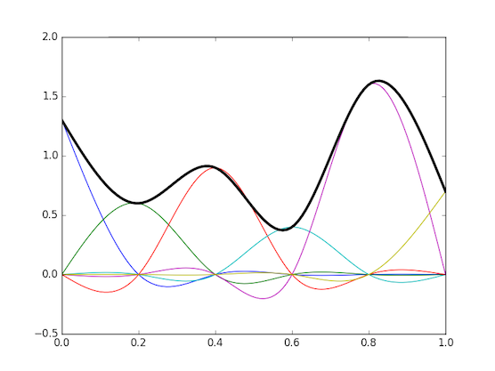

```{r setup, include=FALSE}
knitr::opts_chunk$set(echo = TRUE, 
                      message = FALSE, 
                      warning = FALSE, 
                      cache = TRUE,
                      fig.width = 6, 
                      fig.asp = 0.418,
                      fig.align = "center",
                      dpi = 300)
library(tidyverse)
theme_set(theme_light())
```

# Who's that guy?! 

## Olivier Gimenez
* Senior scientist at CNRS, in Montpellier - France. 
* Trained as a statistician 
* Soon attracted by the bright side of ecology 
* Working at the interface of animal demography, statistical modelling and social sciences 
* More on <https://oliviergimenez.github.io/>
* Twitter @oaggimenez

# Acknowledgments

## Acknowledgments
* Sean Anderson, Ben Bolker, Jason Matthiopoulos, David Miller, Denis Réale and Francisco Rodriguez-Sanchez for sharing their courses material

# This Class 

## Slides, R codes, data and practicals

* I used `R`, and `RStudio` is your friend
* I also used `R Markdown` to write reproducible documents (slides/exercises)
* All material is available on GitHub <https://github.com/oliviergimenez/statistics-for-ecologists-Master-courses>
* Check out the files `gimenez_lectures.R` and `gimenez_practicals.R`
* You will need the following R packages: `arm`, `bbmle`, `broom`, `dplyr`, `effects`, `lme4`, `mgcv`, `MuMIn`, `R2jags`, `tibble`, `visreg`


## On our plate 
* Distributions and likelihoods 
* Hypothesis testing and multimodel inference 
* Introduction to Bayesian inference 
* Generalized Linear Models (GLMs) 
* Generalized Additive Models (GAMs) 
* Mixed Effect Models

## On our plate 
* \alert{Distributions and likelihoods} 
* Hypothesis testing and multimodel inference 
* Introduction to Bayesian inference 
* Generalized Linear Models (GLMs) 
* Generalized Additive Models (GAMs) 
* Mixed Effect Models

# Distributions and likelihoods 
## Distributions

* What for? 
* Conceptual models, bearing in mind that:

> All models are wrong, but some are useful (G.E.P. Cox, 1976)

* Either represent how the world works
* Or capture the behavior of a statistic under some null hypothesis we'd like to test
* Discrete or continuous

# Discrete distributions

## Bernoulli distribution

**Context**: A single trial with two outcomes, success/failure

$X \sim \text{Bern}(p)$ with $p$ probability of having a success

| $x$  | $P(X=x)$  | 
|----+-----------| 
| 1  | $p$ | 
| 0  | $1-p$ |

**Example**: $X$ is the random variable *being born a female*

## Ten Bernoulli trials with $p=0.5$ 
```{r, echo=FALSE} 
set.seed(1975)
rbinom(10,1,0.5) %>% 
  as_tibble() %>%
  mutate(value = as_factor(value)) %>%
  mutate(levels = fct_recode(value, "male" = "0", "female" = "1")) %>%
  count(levels) %>%
  ggplot(aes(x = levels, y = n)) +
  geom_col(fill = "#009E73", color = "black") +
  labs(x = "", y = "")
```

## Ten Bernoulli trials with $p=0.5$, again 
```{r, echo=FALSE} 
set.seed(1979)
rbinom(10,1,0.5) %>% 
  as_tibble() %>%
  mutate(value = as_factor(value)) %>%
  mutate(levels = fct_recode(value, "male" = "0", "female" = "1")) %>%
  count(levels) %>%
  ggplot(aes(x = levels, y = n)) +
  geom_col(fill = "#009E73", color = "black") +
  labs(x = "", y = "")
```

## Hundred Bernoulli trials with $p=0.5$ 
```{r, echo=FALSE} 
rbinom(100,1,0.5) %>% 
  as_tibble() %>%
  mutate(value = as_factor(value)) %>%
  mutate(levels = fct_recode(value, "male" = "0", "female" = "1")) %>%
  count(levels) %>%
  ggplot(aes(x = levels, y = n)) +
  geom_col(fill = "#009E73", color = "black") +
  labs(x = "", y = "")
```

## Hundred Bernoulli trials with $p=0.2$ 
```{r, echo=FALSE} 
rbinom(100,1,0.2) %>% 
  as_tibble() %>%
  mutate(value = as_factor(value)) %>%
  mutate(levels = fct_recode(value, "male" = "0", "female" = "1")) %>%
  count(levels) %>%
  ggplot(aes(x = levels, y = n)) +
  geom_col(fill = "#009E73", color = "black") +
  labs(x = "", y = "")
```

## Hundred Bernoulli trials with $p=0.8$ 
```{r, echo=FALSE} 
rbinom(100,1,0.8) %>% 
  as_tibble() %>%
  mutate(value = as_factor(value)) %>%
  mutate(levels = fct_recode(value, "male" = "0", "female" = "1")) %>%
  count(levels) %>%
  ggplot(aes(x = levels, y = n)) +
  geom_col(fill = "#009E73", color = "black") +
  labs(x = "", y = "")
```

## Summary: Bernoulli distribution 
* **notation**: $X \sim \text{Bern}(p)$ 
* **range**: discrete, $x = 0, 1$ 
* **distribution**: $P(X=x) = p^x (1-p)^{1-x}$ 
* **parameters**: $p$ is the probability of success 
* **mean**: $p$ 
* **variance**: $p(1-p)$


## Binomial distribution

**Context**: Total number of successes from a fixed number of independent Bernoulli trials, all with same probability of success

$X \sim \text{Bin}(N,p)$ with $p$ probability of having a success and $N$ number of trials

$$P(X=x) = {{N!}\over{x!(N-x)!}}p^x(1-p)^{N-x} = \binom{N}{x}p^x(1-p)^{N-x}$$

**Example**: $X$ is the random variable *number of heads in a series of coin flipping*

## Binomial distribution

$$P(X=x) = \binom{N}{x}p^x(1-p)^{N-x}$$

| $x$  | $P(X=x)$  | 
|----+-----------| 
| 0  | $(1-p)^N$ | 
| 1  | $Np(1-p)^{N-1}$ |
| ...  | ... |
| N  | $p^N$ |

## Binomial distribution

| $x$  | $P(X=x)$  | 
|----+-----------| 
| 0  | $(1-p)^N$ | 
| 1  | $Np(1-p)^{N-1}$ |
| ...  | ... |
| N  | $p^N$ |

Fortunately, ```R``` has this pre-programmed 
```{r,collapse=TRUE}
dbinom(x = 1, size = 10, prob = 0.5) # equals 10*0.5*(1-0.5)^(10-1)
```

## Hundred Binomial trials with $N=10$ and $p=0.5$ 
```{r, echo=FALSE} 
rbinom(100,10,0.5) %>% 
  as_tibble() %>%
  mutate(value = as_factor(value)) %>%
  count(value) %>%
  ggplot(aes(x = value, y = n, fill = value)) +
  geom_col() +
  labs(x = "", y = "") +
  scale_fill_brewer(palette = "PiYG") +
  theme(legend.position = "none")
```

## Hundred Binomial trials with $N=10$ and $p=0.5$, again 
```{r, echo=FALSE} 
rbinom(100,10,0.5) %>% 
  as_tibble() %>%
  mutate(value = as_factor(value)) %>%
  count(value) %>%
  ggplot(aes(x = value, y = n, fill = value)) +
  geom_col() +
  labs(x = "", y = "") +
  scale_fill_brewer(palette = "PiYG") +
  theme(legend.position = "none")
```

## Hundred Binomial trials with $N=10$ and $p=0.2$ 
```{r, echo=FALSE} 
rbinom(100,10,0.2) %>% 
  as_tibble() %>%
  mutate(value = as_factor(value)) %>%
  count(value) %>%
  ggplot(aes(x = value, y = n, fill = value)) +
  geom_col() +
  labs(x = "", y = "") +
  scale_fill_brewer(palette = "PiYG") +
  theme(legend.position = "none")
```

## Hundred Binomial trials with $N=10$ and $p=0.8$ 
```{r, echo=FALSE} 
rbinom(100,10,0.8) %>% 
  as_tibble() %>%
  mutate(value = as_factor(value)) %>%
  count(value) %>%
  ggplot(aes(x = value, y = n, fill = value)) +
  geom_col() +
  labs(x = "", y = "") +
  scale_fill_brewer(palette = "PiYG") +
  theme(legend.position = "none")
```

## Playing around with probabilities 
\begin{itemize}[<+- | alert@+>]
\item Let's say $X \sim \text{Bin}(N=10,p=0.5)$ is a random variable counting the number of males
\item What is the probability of having at most 2 males?
  \item $P(X \leq 2) = P(X=0) + P(X=1)$
  \item How to compute this in R?
  \item dbinom(x=0,size=10,prob=0.5) + dbinom(x=1,size=10,prob=0.5)
\end{itemize}


## Summary: Binomial distribution 
* **notation**: $X \sim \text{Bin}(N,p)$ 
  * **range**: discrete, $0 \leq x \leq N$ 
  * **distribution**: $P(X=x) = \binom{N}{x}p^x (1-p)^{1-x}$ 
  * **parameters**: $p$ the probability of success, and $N$ the number of trials 
* **mean**: $Np$ 
  * **variance**: $Np(1-p)$ 
  * **in R**: ```rbinom```, ```dbinom```


## Poisson distribution

**Context**: Number of occurrences of an event over a given unit of space or time. 

$X \sim \text{Poisson}(\lambda)$ with $\lambda$ expected number of occurrences

$$P(X=x) = {{e^{-\lambda}\lambda^x}\over{x!}}$$
  
**Example**: $X$ is the random variable *number of birds counted on a colony during the breeding season*
  
  
## Poisson distribution
  
  $$P(X=x) = {{e^{-\lambda}\lambda^x}\over{x!}}$$
  
  | $x$  | $P(X=x)$  | 
  |----+-----------| 
  | 0  | $e^{-\lambda}$ | 
  | 1  | $\lambda e^{-\lambda}$ |
  | ...  | ... |
  
## Poisson distribution
  
  | $x$  | $P(X=x)$  | 
  |----+-----------| 
  | 0  | $e^{-\lambda}$ | 
  | 1  | $\lambda e^{-\lambda}$ |
  | ...  | ... |
  
Fortunately, ```R``` has this pre-programmed 
```{r,collapse=TRUE}
dpois(x=0,lambda=3) # equals exp(-3)
```

## Hundred Poisson trials with $\lambda=1$ 
```{r, echo=FALSE} 
rpois(n = 100, lambda = 1) %>% 
  as_tibble() %>%
  mutate(value = as_factor(value)) %>%
  count(value) %>%
  ggplot(aes(x = value, y = n, fill = value)) +
  geom_col() +
  labs(x = "", y = "") +
  scale_fill_brewer(direction = -1, palette = "PuOr") +
  theme(legend.position = "none")
```

## Hundred Poisson trials with $\lambda=2$ 
```{r, echo=FALSE} 
rpois(n = 100, lambda = 2) %>% 
  as_tibble() %>%
  mutate(value = as_factor(value)) %>%
  count(value) %>%
  ggplot(aes(x = value, y = n, fill = value)) +
  geom_col() +
  labs(x = "", y = "") +
  scale_fill_brewer(direction = -1, palette = "PuOr") +
  theme(legend.position = "none")
```

## Hundred Poisson trials with $\lambda=10$ 
```{r, echo=FALSE} 
rpois(n = 100, lambda = 10) %>% 
  as_tibble() %>%
  mutate(value = as_factor(value)) %>%
  count(value) %>%
  ggplot(aes(x = value, y = n, fill = value)) +
  geom_col() +
  labs(x = "", y = "") +
  theme(legend.position = "none")
```

## Thousand Poisson trials with $\lambda=10$ 
```{r, echo=FALSE} 
rpois(n = 1000, lambda = 10) %>% 
  as_tibble() %>%
  mutate(value = as_factor(value)) %>%
  count(value) %>%
  ggplot(aes(x = value, y = n, fill = value)) +
  geom_col() +
  labs(x = "", y = "") +
  theme(legend.position = "none")
```

## Summary: Poisson distribution 
* **notation**: $X \sim \text{Poisson}(\lambda)$ 
  * **range**: discrete, $x \geq 0$ 
  * **distribution**: $P(X=x) = {{e^{-\lambda}\lambda^x}\over{x!}}$ 
  * **parameters**: $\lambda$ the rate or expected number per sample
* **mean**: $\lambda$ 
  * **variance**: $\lambda$ 
  * **in R**: ```rpois```, ```dpois```

# Continuous distribution

## Normal (Gaussian) distribution

**Context**: Distribution of “adding lots of things together”. Derived from *Central Limit Theorem*, which says that if you add a large number of independent samples from the same distribution the distribution of the sum
will be approximately normal.

$X \sim \text{Normal}(\mu,\sigma^2)$ where $\mu$ is the mean and $\sigma^2$ the variance

$$f(x) = {{1}\over{\sqrt{2\pi\sigma}}}\exp\left(  - {{(x-\mu)^2}\over{2\sigma^2}} \right)$$
  
  **Example**: Practically everything.

## Normal probability density function 
```{r, echo=FALSE, fig.asp=0.618} 
min.x <- -5
max.x <- 5
num.samples <- 1000
x <- seq(from = min.x, to = max.x, length = num.samples)
# Open new blank plot with x limits from -5 to 5, and y limits from 0 to 1
plot(c(-5, 5), c(0, 1), xlab = 'x', ylab = 'f(x)', main = "", type = "n")
# Add each density plot one at a time
lines(x, dnorm(x, mean = 0, sd = 0.5), lwd = 3, col = 'red')
lines(x, dnorm(x, mean = 0, sd = 1), lwd = 3, col = 'green')
lines(x, dnorm(x, mean = 0, sd = 2), lwd =3, col = 'blue')
lines(x, dnorm(x, mean = -2, sd = 1), lwd = 3, col = 'magenta')
# We can also add a legend to the plot  
legend("topright", 
       c("mu=0, sigma=0.5", "mu=0, sigma=1", "mu=0, sigma=2", "mu=-2, sigma=1"), 
       col = c('red','green','blue','magenta'),
       lty = 1,
       lwd = 3)
```

## Summary: Normal distribution 
* **notation**: $X \sim \text{N}(\mu,\sigma^2)$ 
  * **range**: continuous, all real values 
* **distribution**: $f(x) = {{1}\over{\sqrt{2\pi\sigma}}}\exp\left(  - {{(x-\mu)^2}\over{2\sigma^2}} \right)$ 
  * **parameters**: $\mu$ the mean and $\sigma$ the standard deviation
* **mean**: $\mu$ 
  * **variance**: $\sigma^2$ 
  * **in R**: ```rnorm```, ```dnorm```

## Why do we love the Normal distribution 

* If has nice properties, such as: if $X \sim \text{N}(\mu,\sigma^2)$, then $Z = \displaystyle{{{X - \mu}\over{\sigma}} \sim \text{N}(0,1)}$
  
* It is a limiting distribution (*Central Limit Theorem*)

* It can be a good approximation for other distributions


## Example: Approximating Binomial by Normal (1)

$X \sim \text{Bin}(N=50,p=0.3)$
  
Mean is $Np = 50 \times 0.3 = 15$
  
Variance is $Np(1-p) = 50 \times 0.3 \times 0.7 = 10.5$
  
Therefore, $X$ can be approximated by $Y \sim \text{N}(15,\sigma=\sqrt{10.5})$
  

## Example: Approximating Binomial by Normal (2)
  
```{r, echo=FALSE, fig.asp=0.618} 
n<-50
p<-0.3
f<-hist(rbinom(100000, n,p), freq=FALSE, breaks=n/2,main="", xlab="x")
x<-f$breaks
lines(x,dnorm(x,n*p,sqrt(n*p*(1-p))),col='red',lwd=3)
abline(v=15,lwd=2,col='blue',lty=2)
```

# Conclusions about distributions

## Common Distributions - Discrete

* When we have something that is dichotomous (either 0 or 1, negative/positive, false/true, male/female, present/absent):
  
$$\text{Binomial(number of trials, probability)}$$
  
* When we have something that is a discrete count, with no theoretical maximum, but with a common average:
  
$$\text{Poisson(lambda)}$$
  
## Common Distributions - Discrete
  
* When we are recording the number of *failures* before a number of *successes*, or when we have something that is a discrete count with no theoretical maximum, and with more variation than Poisson:
  
$$\text{NegativeBinomial(number of successes, probability of success)}$$
$$\text{NegativeBinomial(mean, overdispersion)}$$
  
## Common Distributions - Continuous
  
* When we have something that is continuous, symmetrical about the mean and unbounded:
  
$$\text{Normal(mean, standard deviation)}$$
  
* When we have something that is continuous, not symmetrical, and bounded at zero:
  
$$\text{Exponential(rate)}$$
  
$$\text{Gamma(shape, rate)}$$
  
## Common Distributions - Continuous
  
* When we have something that is continuous, not symmetrical, and bounded at zero:
  
$$\text{Lognormal(logmean, logstdev)}$$
  
* When we have something that is continuous, and bounded between 0 and 1:
  
$$\text{Beta(alpha, beta)}$$
  
* Simple bounded distribution:
  
$$\text{Uniform(min, max)}$$
  
## More? Check out in R:
```{r}
?Distributions
```

# Likelihoods

## Fitting distributions to data

* So far, when talking about probability distributions, we assumed that we
knew the parameter values

* And we wanted to know what data we might get from these distributions

* In the real world, it is usually the other way around

* A more relevant question might be:
  
> We have observed 3 births by a female during her 10 breeding
attempts. What does this tell us about the true probability of
getting a successful breeding attempt from this female? For the population?
  
## Fitting distributions to data
  
We don’t know what the probability of a birth is, but we can see what the probability of getting our data would be for different
values:
  
```{r,collapse=TRUE}
dbinom(x = 3, size = 10, prob = 0.1)
```

## Fitting distributions to data

We don’t know what the probability of a birth is, but we can see what the probability of getting our data would be for different
values:
  
```{r,collapse=TRUE}
dbinom(x=3,size=10,prob=0.9)
```

## Fitting distributions to data

We don’t know what the probability of a birth is, but we can see what the probability of getting our data would be for different
values:
  
```{r,collapse=TRUE}
dbinom(x=3,size=10,prob=0.25)
```

So we would be more likely to observe 3 births if the probability is
0.25 than 0.1 or 0.9

## The likelihood

* This reasoning is so common in statistics that it has a special name:
  
* \alert{The likelihood} is the probability of observing the data under a certain model

* The data are known, we usually consider the likelihood as a function of the model parameters $\theta_1,\theta_2, \ldots, \theta_p$
  
$$L = P(\theta_1,\theta_2, \ldots, \theta_p \mid \text{data})$$
  
* This is a very important concept

## Likelihood functions

We may create a function to calculate a likelihood e.g.:
  
```{r,collapse=TRUE}
lik.fun <- function(parameter){
  ll <- dbinom(x=3, size=10, prob=parameter)
  return(ll)
}

lik.fun(0.3)

lik.fun(0.6)
```

## Maximize the likelihood (3 successes ot of 10 attempts)

```{r, echo=FALSE}
lik.fun <- function(parameter){
  ll <- dbinom(x=3, size=10, prob=parameter)
  return(ll)
}
p.grid = seq(0,1,by=0.01)
lik = rep(NA,length(p.grid))
for (i in 1:length(p.grid)){
  lik[i] <- lik.fun(p.grid[i])
}
plot(p.grid, lik, 
     xlab = 'prob. of getting a successful breeding attempt',
     ylab = 'likelihood',
     type = 'l',
     lwd = 3)
abline(v = 0.3,
       lty = 2,
       lwd = 2,
       col = 'blue')
```

The *maximum* of the likelihood is at value $0.3$
  
## The Maximum Likelihood
  
* There is always a set of parameters that gives you the highest likelihood of observing the data: the \alert{Maximum Likelihood Estimate(s) [MLEs]}

* This can be calculated using:
  
+ Trial and error (not efficient!)
+ Compute the maximum of a function by hand (rarely doable in practice)
+ An iterative optimization algorithm: `?optimize` ($1$ parameter) and `?optim` ($> 1$ parameter) in `R`

## \alert{By hand}: compute MLE of $p$ from $Y \sim \text{Bin}(N=10,p)$ with $k=3$ successes

$P(Y=k) = {{k}\choose{N}} p^k (1-p)^{N-k} = L(p)$
  
$\log(L(p)) = \text{cte} + k \log(p) + (N-k) \log(1-p)$
  
We are searching for the maximum of $L$, or equivalently that of $\log(L)$
  
Compute derivate w.r.t. $p$: $\displaystyle{{{d\log(L)}\over{dp}} = {{k}\over{p}} – {{(N-k)}\over{(1-p)}}}$
  
Then solve $\displaystyle{{{d\log(L)}\over{dp}}=0}$; the MLE is $\displaystyle{\hat{p} = {{k}\over{N}}={{3}\over{10}}=0.3}$
  
Here, the MLE is the proportion of observed successes

## \alert{Using a computer}: MLE of $p$ from $Y \sim \text{Bin}(N=10,p)$ with $k=3$ successes

```{r,collapse=TRUE}
lik.fun <- function(parameter) dbinom(x=3, size=10, prob=parameter)
# ?optimize
optimize(lik.fun,c(0,1),maximum=TRUE)
```

Use `optim` when the number of parameters is $> 1$.

## \alert{Using a computer}: MLE of $p$ from $Y \sim \text{Bin}(N=10,p)$ with $k=3$ successes

```{r, echo=FALSE, fig.asp=0.618}
lik.fun <- function(parameter) dbinom(x=3, size=10, prob=parameter)
plot(lik.fun,0,1,xlab="probability of success (p)",ylab="log-likelihood(p)",main="Binomial likelihood with 3 successes ot of 10 attempts",lwd=3)
abline(v=0.3,h=0.26682,col='blue',lty=2,lwd=2)
```

## The Maximum Likelihood Estimate (MLE)

* \alert{The MLE is the best guess set of parameter values for our given data}

## A dart target, with the red cross representing the true parameter value

```{r echo = FALSE, fig.asp=0.7}
library(plotrix)
plot(0,0,type = "n", xlim = c(-1.4,1.4), ylim = c(-10,10),axes=F,xlab='',ylab='',main = 'Imprecise and biased')
draw.circle(0,0,radius=0.7,lty=1,lwd=2,border='black')
draw.circle(0,0,radius=0.5,lty=1,lwd=2,border='black')
draw.circle(0,0,radius=0.3,lty=1,lwd=2,border='black')
draw.circle(0,0,radius=0.1,lty=1,lwd=2,border='black')
points(0,0,col='red',cex=2,pch=4)
for (i in 1:35){
  points(runif(1,-0.3,0.5),runif(1,2,6.5),col='blue',cex=1,pch=19)
}
```

## A dart target, with the red cross representing the true parameter value

```{r echo = FALSE, fig.asp=0.7}
plot(0,0,type = "n", xlim = c(-1.4,1.4), ylim = c(-10,10),axes=F,xlab='',ylab='',main = 'Precise but biased')
draw.circle(0,0,radius=0.7,lty=1,lwd=2,border='black')
draw.circle(0,0,radius=0.5,lty=1,lwd=2,border='black')
draw.circle(0,0,radius=0.3,lty=1,lwd=2,border='black')
draw.circle(0,0,radius=0.1,lty=1,lwd=2,border='black')
points(0,0,col='red',cex=2,pch=4)
for (i in 1:35){
  points(runif(1,0.3,0.5),runif(1,3.5,5.5),col='blue',cex=1,pch=19)
}
```

## A dart target, with the red cross representing the true parameter value

```{r echo = FALSE, fig.asp=0.7}
plot(0,0,type = "n", xlim = c(-1.4,1.4), ylim = c(-10,10),axes=F,xlab='',ylab='',main = 'Unbiased but imprecise')
draw.circle(0,0,radius=0.7,lty=1,lwd=2,border='black')
draw.circle(0,0,radius=0.5,lty=1,lwd=2,border='black')
draw.circle(0,0,radius=0.3,lty=1,lwd=2,border='black')
draw.circle(0,0,radius=0.1,lty=1,lwd=2,border='black')
points(0,0,col='red',cex=2,pch=4)
for (i in 1:35){
  points(runif(1,-0.3,0.3),runif(1,-3.5,3.5),col='blue',cex=1,pch=19)
}
```

## A dart target, with the red cross representing the true parameter value

```{r echo = FALSE, fig.asp=0.7}
plot(0,0,type = "n", xlim = c(-1.4,1.4), ylim = c(-10,10),axes=F,xlab='',ylab='',main = 'Unbiased and precise!')
draw.circle(0,0,radius=0.7,lty=1,lwd=2,border='black')
draw.circle(0,0,radius=0.5,lty=1,lwd=2,border='black')
draw.circle(0,0,radius=0.3,lty=1,lwd=2,border='black')
draw.circle(0,0,radius=0.1,lty=1,lwd=2,border='black')
points(0,0,col='red',cex=2,pch=4)
for (i in 1:35){
  points(runif(1,-0.15,0.15),runif(1,-1.5,1.5),col='blue',cex=1,pch=19)
}
```

## The Maximum Likelihood Estimate (MLE)

* The MLE is the best guess set of parameter values for our given data

* \alert{But the chances of the true parameter values being close to the MLE is dependent on the amount of information in the data!}

## Binomial likelihood with increasing sample size

```{r, echo=FALSE, fig.asp = 0.618}
lik.fun <- function(parameter) dbinom(x=3, size=10, prob=parameter,log=TRUE)
plot(lik.fun,0,1,xlab="probability of success (p)",ylab="log-likelihood(p)",main="",lwd=3)
lik.fun <- function(parameter) dbinom(x=30, size=100, prob=parameter,log=TRUE)
plot(lik.fun,0,1,add=T,col='blue',lwd=3)
lik.fun <- function(parameter) dbinom(x=300, size=1000, prob=parameter,log=TRUE)
plot(lik.fun,0,1,add=T,col='red',lwd=3)
abline(v=0.3,col='grey',lty=2)
legend('bottomright',c('3 out of 10','30 out of 100','300 out of 1000'), col=c('black','blue','red'),lty=1,lwd=2)
```

# Confidence intervals: A refresher

## Let's approach confidence intervals through simulations

```{r, message=FALSE, warning=FALSE, include=FALSE}
library(dplyr)
library(ggplot2)
set.seed(12345) # try different values
```

Imagine you are measuring the temperature of a cup of water 10 times but you have an old really bad thermometer. 
The true temperature is 3 degrees Celsius and the standard deviation on the sampling error is 5.

```{r, message=FALSE, warning=FALSE}
# Simulate data:
mu <- 3
sigma <- 5
n <- 10
y <- rnorm(n = n, mean = mu, sd = sigma)
y
```

## Apply linear regression

We will estimate a mean temperature by fitting an intercept only linear regression model:
  
```{r, message=FALSE, warning=FALSE,collapse=TRUE}
m <- lm(y~1)
broom::tidy(m)

confint(m)
```


## Let's illustrate what those confidence intervals really represent. 

* Imagine you went outside 20 times and each time you measured the cup of water 10 times. Then you fitted a linear regression model with an intercept only each time and plotted the confidence intervals.

```{r, echo=FALSE, message=FALSE, warning=FALSE}
N <- 20
sim_ci <- NULL
for (i in 1:N){
  y <- rnorm(n = n, mean = mu, sd = sigma)
  m <- lm(y~1)
  ci <- confint(m, level = 0.95)
  sim_ci <- rbind(sim_ci,data.frame(l = ci[1], u = ci[2], y = y, i = i))
}
```

* 19 times out 20 (95%) the 95% confidence intervals should contain the true value. 

## Does that look approximately correct?

```{r, echo=FALSE, fig.height=5, fig.asp=.4}
sim_ci %>%
  filter(i <= 10) %>%
  ggplot(aes(1, y)) +
  geom_point(alpha = 0.2) +
  geom_hline(aes(yintercept = l)) +
  geom_hline(aes(yintercept = u)) +
  geom_hline(yintercept = mu, colour = "red") +
  labs(x = "", y = "") +
  facet_wrap(~i, ncol = 5, scales = "free") +
  xlim(0.99, 1.01) + 
  theme(axis.title.x = element_blank(),
        axis.text.x = element_blank(),
        axis.ticks.x = element_blank())
```

## Does that look approximately correct?

```{r, echo=FALSE, fig.height=5, fig.asp=.4}
sim_ci %>%
  filter(i > 10) %>%
  ggplot(aes(1, y)) +
  geom_point(alpha = 0.2) +
  geom_hline(aes(yintercept = l)) +
  geom_hline(aes(yintercept = u)) +
  geom_hline(yintercept = mu, colour = "red") +
  labs(x = "", y = "") +
  facet_wrap(~i, ncol = 5, scales = "free") +
  xlim(0.99, 1.01) + 
  theme(axis.title.x = element_blank(),
        axis.text.x = element_blank(),
        axis.ticks.x = element_blank())
```

Confidence intervals are just \alert{one realization} of a theoretically repeated experiment.


## Likelihood key facts

* The likelihood is \alert{the probability of observing a (fixed) dataset given a set of parameter values} (to be estimated)

* Maximum likelihood theory provides \alert{estimates with optimal properties}: unbiased, minimal variance and normally distributed (asymptotically)

* The \alert{rate of change of the likelihood} around the MLE is an indication of our confidence in the estimated parameter values

* Use \alert{confidence intervals to capture uncertainty} surrounding MLEs

* Likelihood functions \alert{can get very complicated!}


## Textbooks

```{r, out.width = '10cm',out.height='7.5cm',fig.align='center',echo=FALSE}
knitr::include_graphics('img/textbooks1.png')    
```

# This Class 

## On our plate 
* Distributions and likelihoods
* \alert{Hypothesis testing and multimodel inference}  
* Introduction to Bayesian inference 
* Generalized Linear Models (GLMs) 
* Generalized Additive Models (GAMs) 
* Mixed Effect Models


## Hypothesis testing: Rationale

The problem: 

> Suppose a coin toss turns up $k = 12$ heads out of $N = 20$ trials. 
Can we say that the coin toss is fair? Do we get more heads than expected (assuming the coin toss is fair)?

## Hypothesis testing: Rationale

1. \alert{Define the null and alternative hypotheses}. 
The null hypothesis is usually the one that represents the less complicated explanation of the real world

* $H_0$: the coin toss is fair

* $H_1$: the coin toss is unfair, we get more heads or tails than expected

## Hypothesis testing: Rationale

2. \alert{Construct a sampling distribution for the estimator under $H_0$}

* The number of heads $X$ is a Binomial distribution with parameter $p$

* Under $H_0$, we have $p = p_0$ with $p_0=0.5$ if the coin toss is fair

* Under $H_1$, we have $p \neq p_0$

* Remember that an estimator of $p$ is the MLE $\hat{p} = k/N$, which is normally distributed with mean $p$ and some variance; therefore, we have under $H_0$:

$${{\hat{p} - p_0}\over{\sqrt{p_0(1-p_0)/N}}} \sim \text{Normal}(0,1)$$

## Hypothesis testing: Rationale
2. \alert{Construct a sampling distribution for the estimator under $H_0$}

```{r, echo=FALSE, fig.asp=0.65}
curve(dnorm(x,0,1),xlim=c(-3,3),main='', xlab = "", ylab="")
text(x = -2,y = 0.35,'Normal distribution N(0,1)', cex=0.9)
```

## Hypothesis testing: Rationale

3. The sampling distribution will assign a likelihood to every possible value of the estimator. \alert{Very small values of likelihood -- at the extremes of the sampling distribution -- can be taken as evidence that the population generating the data has a parameter different to the one postulated by $H_0$}. 

A probability value $\alpha$ is chosen to represent the level of significance required of the result. For example $\alpha = 0.05$ means that, under $H_0$, the estimator will be found in the extreme regions of parameter space only five times every one hundred samples.

## Hypothesis testing: Rationale
3. For example, say the level of significance is $\alpha = 0.05$

```{r, echo=FALSE, fig.asp=0.65}
 curve(dnorm(x,0,1),xlim=c(-3,3),main='', xlab = "", ylab="") 
cord.x <- c(-2,seq(-2,2,0.01),2) 
 cord.y <- c(0,dnorm(seq(-2,2,0.01)),0) 
 polygon(cord.x,cord.y,col='skyblue')
text(x=0,y=0.2,'95%')
```

## Hypothesis testing: Rationale
3. For example, say the level of significance is $\alpha = 0.05$

```{r, echo=FALSE, fig.asp=0.65}
 curve(dnorm(x,0,1),xlim=c(-3,3),main='', xlab = "", ylab="") 
cord.x <- c(-3,seq(-3,-2,0.01),-2) 
 cord.y <- c(0,dnorm(seq(-3,-2,0.01)),0) 
 polygon(cord.x,cord.y,col='skyblue')
cord.x <- c(2,seq(2,3,0.01),3) 
 cord.y <- c(0,dnorm(seq(2,3,0.01)),0) 
 polygon(cord.x,cord.y,col='skyblue')
 text(x=-2.5,y=0.05,'2.5%')
 text(x=2.5,y=0.05,'2.5%')
```

## Hypothesis testing: Rationale

4. Find the values that tell us if a particular estimate is extreme

```{r, echo=FALSE, fig.asp=0.65}
 curve(dnorm(x,0,1),xlim=c(-3,3),main='', xlab = "", ylab="") 
cord.x <- c(-3,seq(-3,-2,0.01),-2) 
 cord.y <- c(0,dnorm(seq(-3,-2,0.01)),0) 
 polygon(cord.x,cord.y,col='skyblue')
cord.x <- c(2,seq(2,3,0.01),3) 
 cord.y <- c(0,dnorm(seq(2,3,0.01)),0) 
 polygon(cord.x,cord.y,col='skyblue')
 text(x=-2.5,y=0.05,'2.5%')
 text(x=2.5,y=0.05,'2.5%')
```

## Hypothesis testing: Rationale

4. Find the values that tell us if a particular estimate is extreme

```{r, echo=FALSE, fig.asp=0.65}
 curve(dnorm(x,0,1),xlim=c(-3,3),main='', xlab = "", ylab="") 
cord.x <- c(-3,seq(-3,-2,0.01),-2) 
 cord.y <- c(0,dnorm(seq(-3,-2,0.01)),0) 
 polygon(cord.x,cord.y,col='skyblue')
cord.x <- c(2,seq(2,3,0.01),3) 
 cord.y <- c(0,dnorm(seq(2,3,0.01)),0) 
 polygon(cord.x,cord.y,col='skyblue')
 text(x=-2.5,y=0.05,'2.5%')
 text(x=2.5,y=0.05,'2.5%')
arrows(-2,0.1,-2,0,col='red',lwd=3,angle=20,length=0.15)
arrows(2,0.1,2,0,col='red',lwd=3,angle=20,length=0.15)
```

## Hypothesis testing: Rationale

4. Find the values that tell us if a particular estimate is significantly different from what would be expected under $H_0$

* Straightforward in `R`:

```{r,collapse=TRUE}
alpha <- 0.05 
z.half.alpha <- qnorm(1 - alpha/2) 
c(- z.half.alpha, z.half.alpha) 
```

## Hypothesis testing: Rationale

4. Find the values that tell us if a particular estimate is extreme

```{r, echo=FALSE, fig.asp=0.65}
 curve(dnorm(x,0,1),xlim=c(-3,3),main='', xlab = "", ylab="") 
cord.x <- c(-3,seq(-3,-2,0.01),-2) 
 cord.y <- c(0,dnorm(seq(-3,-2,0.01)),0) 
 polygon(cord.x,cord.y,col='skyblue')
cord.x <- c(2,seq(2,3,0.01),3) 
 cord.y <- c(0,dnorm(seq(2,3,0.01)),0) 
 polygon(cord.x,cord.y,col='skyblue')
 text(x=-2.5,y=0.05,'2.5%')
 text(x=2.5,y=0.05,'2.5%')
arrows(-2,0.1,-2,0,col='red',lwd=3,angle=20,length=0.15)
arrows(2,0.1,2,0,col='red',lwd=3,angle=20,length=0.15)
 text(x=-2,y=0.15,'-1.959964',col='red')
 text(x=2,y=0.15,'1.959964',col='red')
```

## Hypothesis testing: Rationale

5. The estimate ($\hat{q}$) is calculated from the data and compared with the critical value(s)

$${{\hat{p} - p_0}\over{\sqrt{p_0(1-p_0)/N}}} = {{12/20 - 0.5}\over{\sqrt{0.5(1-0.5)/20}}} = 0.89$$

## Hypothesis testing: Rationale

6. \alert{If the estimate falls in the region of extreme values, then $H_0$ is rejected}, otherwise we say that there is not enough evidence to reject it

* The test statistic 0.89 lies between the critical values -1.96 and 1.96. Hence, at $\alpha = 0.05$ significance level, we do not reject the null hypothesis that the coin toss is fair 

## Hypothesis testing: Rationale

6. \alert{If the estimate falls in the region of extreme values, then $H_0$ is rejected}

```{r, echo=FALSE, fig.asp=0.65}
 curve(dnorm(x,0,1),xlim=c(-3,3),main='', xlab = "", ylab="") 
cord.x <- c(-2,seq(-2,2,0.01),2) 
 cord.y <- c(0,dnorm(seq(-2,2,0.01)),0) 
 polygon(cord.x,cord.y,col='skyblue')
text(x=0,y=0.2,'95%')
arrows(0.89,0.35,0.89,0,col='red',lwd=3,angle=20,length=0.15)
text(x=1.8,y=0.35,'observed value (0.89)',col='red')
```

## Hypothesis testing: Rationale

* Another way to test significance is to use the p-value

* Probability that, when $H_0$ is true, the value of the test statistics would be the same 
as or more extreme than the actual observed results

* If the p-value is $< \alpha$, then reject $H_0$

## Hypothesis testing: Rationale

* The p-value is the red area

```{r, echo=FALSE, fig.asp=0.65}
 curve(dnorm(x,0,1),xlim=c(-3,3),main='', xlab = "", ylab="") 
cord.x <- c(0.89,seq(0.89,3,0.01),3) 
 cord.y <- c(0,dnorm(seq(0.89,3,0.01)),0) 
 polygon(cord.x,cord.y,col='red')
cord.x <- c(-3,seq(-3,-0.89,0.01),-0.89) 
 cord.y <- c(0,dnorm(seq(-3,-0.89,0.01)),0) 
 polygon(cord.x,cord.y,col='red')
arrows(-0.89,0.35,-0.89,0,col='black',lwd=3,angle=20,length=0.15)
text(x=-1.3,y=0.35,'-0.89',col='black')
arrows(0.89,0.35,0.89,0,col='black',lwd=3,angle=20,length=0.15)
text(x=1.3,y=0.35,'0.89',col='black')
```

## Hypothesis testing: Rationale

* To compute the p-value, we need $P(X \geq 0.89) + P(X \leq -0.89)$

* This can be obtained in `R` as follows:

```{r,collapse=TRUE}
pval <- 2 * (1 - pnorm(0.89)) # pnorm(x) = P(X <= x)
pval # two−tailed p−value 
```

## Problems with hypothesis testing

```{r, out.width = '7cm',out.height='7cm',fig.align='center',echo=FALSE}
knitr::include_graphics('img/harry_pvalue.jpg')    
```


## Problems with hypothesis testing

\begin{itemize}[<+->]
\item \textbf{Significance levels are arbitrary}: Changing $\alpha$ magically turns an
ordinary result into something worth reporting.
\item \textbf{Results are only qualitative}: We get an idea of whether $H_0$ is true
but not how well supported it is by the data. The use of p--values as measures of
evidence has also received criticism.
\item \textbf{Null hypotheses are guaranteed to be false}: In the sense that all models are wrong,
no population parameter will ever be exactly the same as our expectations.
\item \textbf{A significant result is guaranteed if the sample size is large enough}: $\alpha$ 
must be appropriately chosen in relation to sample size. There are methods for doing this, known as power analyses.
\item \textbf{The dichotomy between a null/alternative hypotheses is limiting}: Why not look at
several candidate values at the same time?
\end{itemize}


# Multimodel inference

## Linear regression example

Impact of climatic conditions on white stork breeding success

```{r, out.width = '12cm',out.height='7cm',fig.align='center',echo=FALSE}
knitr::include_graphics('img/stork_world.png')    
```

## Linear regression example

Impact of climatic conditions on white stork breeding success
```{r,size='scriptsize'}
nb_young <- c(2.55,1.85,2.05,2.88,3.13,2.21,2.43,2.69,2.55,2.84,2.47,2.69,
             2.52,2.31,2.07,2.35,2.98,1.98,2.53,2.21,2.62,1.78,2.30)
temperature <- c(15.1,13.3,15.3,13.3,14.6,15.6,13.1,13.1,15.0,11.7,15.3,
                14.4,14.4,12.7,11.7,11.9,15.9,13.4,14.0,13.9,12.9,15.1,
                13.0)
rainfall <- c(67,52,88,61,32,36,72,43,92,32,86,28,57,55,66,26,28,96,48,90,
             86,78,87)
lin_reg <- lm(nb_young ~ temperature + rainfall)
```

## Linear regression example

Impact of climatic conditions on white stork breeding success
```{r,size='footnotesize',collapse=TRUE}
library(broom)

tidy(lin_reg) # elegant summary using broom package
```

## How to select a best model?

* The proportion of explained variance $R^2$ is problematic, because the more variables you have, the bigger $R^2$ is

* Idea: \alert{penalize models with too many parameters}

## Akaike information criterion (AIC)

$$AIC = - 2 \log(L(\hat{\theta}_1,\ldots,\hat{\theta}_K)) + 2 K$$

with $L$ the likelihood and $K$ the number of parameters $\theta_i$

## Akaike information criterion (AIC)

$$AIC = {\color{red}{- 2 \log(L(\hat{\theta}_1,\ldots,\hat{\theta}_K))}} + 2 K$$

\textcolor{red}{A measure of goodness-of-fit of the model to the data}: the more parameters you have, the smaller the deviance is (or the bigger the likelihood is)

## Akaike information criterion (AIC)

$$AIC = - 2 \log(L(\hat{\theta}_1,\ldots,\hat{\theta}_K)) + {\color{red}{2 K}}$$

\textcolor{red}{A penalty}: twice the number of parameters $K$

## Akaike information criterion (AIC)

* $AIC$ makes the balance between *quality of fit* and *complexity* of a model

* Best model is the one with lowest $AIC$ value

* Two models are difficult to distinguish if $\Delta AIC < 2$

## Back to the linear regression example

Fit all candidate models on white stork data and get their AIC
```{r,size='sciptsize',collapse=T}
linreg_temp_rain <- lm(nb_young ~ temperature + rainfall)
linreg_temp <- lm(nb_young ~ temperature)
linreg_rain <- lm(nb_young ~  rainfall)
linreg_null <- lm(nb_young ~ 1)

c(AIC(linreg_temp_rain),AIC(linreg_temp),AIC(linreg_rain),AIC(linreg_null))
```

Looks as though model with rainfall has the lowest AIC

However, the model with both covariates has an AIC value within 2 units

Where to go from there?! \alert{Multimodel inference}

# Multimodel inference

## AIC weights 

* Let $\Delta \text{AIC}_i$ be the difference between $AIC$ of model $i$ and the lowest AIC (corresponding to the best model)

* Akaike weight $w_i$ for model $i$ gives the probability that model $i$ is the best model 

$$w_i = {{\exp\left(-{{1}\over{2}}\Delta \text{AIC}_i\right)}\over{\displaystyle{\sum_{n=1}^N{\exp\left(-{{1}\over{2}}\Delta \text{AIC}_i\right)}}}}$$


## AIC weights with R: Back to the stork example

Compute the weights:
```{r, message=FALSE, warning=FALSE}
library(bbmle)
AICtab(linreg_temp_rain,linreg_temp,linreg_rain,linreg_null, 
       base = T, weights = T)
```

## Model averaging 

* Model-averaged estimates are weighted averages (by the $w_i$) of the parameters from each of the models $$\bar{\hat{\theta}}_j = \displaystyle{\sum_{i=1}^K{w_i \; \hat{\theta}_j(\text{model}_i)}}$$

## Model-averaged estimate of rainfall effect, by hand (1)

```{r}
tidy(linreg_temp_rain)
```

0.273 * (-0.007315652)

## Model-averaged estimate of rainfall effect, by hand (2)

```{r}
tidy(linreg_temp)
```

0.273 * (-0.007315652) + 0.031 * 0

## Model-averaged estimate of rainfall effect, by hand (3)

```{r}
tidy(linreg_rain)
```

0.273 * (-0.007315652) + 0.031 * 0 + 0.617 * (-0.007163572)

## Model-averaged estimate of rainfall effect, by hand (4)

```{r}
tidy(linreg_null)
```

0.273 * (-0.007315652) + 0.031 * 0 + 0.617 * (-0.007163572) + 0.080 * 0 

\alert{= -0.006417097}

## Model-averaging with R: Back to the stork example

Perform model averaging
```{r, message=FALSE, warning=FALSE,collapse=T}
library(MuMIn)
m.ave <- model.avg(linreg_temp_rain,linreg_temp,linreg_rain,
                                    linreg_null,rank = "AIC")
m.ave$coefficients
```

* The \alert{full} average assumes that a variable is included in every model, but in some models the corresponding coefficient is set to zero.

* The \alert{subset} (or \alert{conditional}) average only averages over the models where the parameter appears.

## Conclusions about multimodel inference

* Several models can be \alert{ranked and weighted} to provide a quantitative measure 
of \alert{relative support} for each competing hypothesis

* If there are two or more models with \alert{similarly high levels of support, model averaging} of this ‘top model set’ provides a robust means of obtaining parameter estimates

* Acknowledge \alert{uncertainty in the selection of a single best model}

## Textbooks

```{r, out.width = '5cm',out.height='7cm',echo=FALSE}
knitr::include_graphics('img/textbooks2.png')    
```


# This Class 

## On our plate 
* Distributions and likelihoods
* Hypothesis testing and multimodel inference  
* \alert{Introduction to Bayesian inference} 
* Generalized Linear Models (GLMs) 
* Generalized Additive Models (GAMs) 
* Mixed Effect Models

# Bayesian inference 

## Introduction
* The Bayesian approach dates back to 18th century to Reverend Thomas Bayes.
```{r, out.width = '4cm',out.height='3cm',echo=FALSE}
knitr::include_graphics('img/Thomas_Bayes.png')    
```
* However, due to practical problems of implementing the Bayesian approach, little advance was made for over two centuries.
* Recent advances in \alert{computational power} coupled with the development of new methodology have led to a great increase in the application of Bayesian methods within the last two decades.


## Classical versus Bayesian	
* Typical stats problems involve estimating parameter $\theta$ with available data.
* The frequentist approach (maximum likelihood estimation – MLE) assumes that \alert{the parameters are fixed, but have unknown values to be estimated}.
* Classical estimates generally provide a \alert{point estimate} of the parameter of interest.
* The Bayesian approach assumes that \alert{the parameters are not fixed but have some fixed  unknown distribution} - a distribution for the parameter.
```{r, out.width = '6cm',out.height='3.5cm',fig.align='center',echo=FALSE}
knitr::include_graphics('img/bayesian_evol.png')    
```

## What is the Bayesian Approach?	
* The approach is based upon the idea that the experimenter begins with \alert{some prior beliefs} about the system.
* And then \alert{updates} these beliefs on the basis of observed data.
* This updating procedure is based upon what is known as Bayes’ Theorem:

$$\Pr(A \mid B) = \frac{\Pr(B \mid A) \; \Pr(A)}{\Pr(B)}$$

## What is the Bayesian Approach?	

* Schematically, if $A = \theta$ and $B = \text{data}$
* The Bayes’ Theorem

$$\Pr(A \mid B) = \frac{\Pr(B \mid A) \; \Pr(A)}{\Pr(B)}$$

* Translates into:

$$\Pr(\theta \mid \text{data}) = \frac{\Pr(\text{data} \mid \theta) \; \Pr(\theta)}{\Pr(\text{data})}$$

## Bayes formula	

$${\color{red}{\Pr(\theta \mid \text{data})}} = \frac{\color{blue}{\Pr(\text{data} \mid \theta)} \; \color{green}{\Pr(\theta)}}{\color{orange}{\Pr(\text{data})}}$$

* \textcolor{red}{Posterior distribution}: the basis for inference, a distribution, possibly multivariate if more than one parameter ($\theta$)

* \textcolor{blue}{Likelihood}: we know that guy from before, same as in the MLE approach

* \textcolor{green}{Prior distribution}: the source of much discussion about the Bayesian approach

* $\color{orange}{\Pr(\text{data}) = \int L(\text{data} \mid \theta) \;\Pr(\theta) d\theta }$: possibly high-dimensional integral, difficult if not impossible to calculate. This is one of the reasons why we need simulation (MCMC) methods - more soon.

## A Simple Example
* Let us take a simple example to fix ideas
* 120 deer were radio-tracked over winter
* 61 close to a plant, 59 far from any human activity
* Question: is there a treatment effect on survival?

|            | Released   | Alive | Dead | Other |
|------------+----------+-------+------+-------| 
| treatment  | 61 | 19 | 38 | 4 |
| control    | 59 | 21 | 38 | 0 |


## A Simple Example
* So, $n = 57$ deer were assigned to the treatment group of which $k=19$ survived the winter.
* Of interest is the probability of \alert{over-winter survival}, call it $\theta$, for the general population within the treatment area.
* The obvious estimate is simply to take the ratio $k/n=19/57$.
* How would the classical statistician justify this estimate?

## A Simple Example
* Our model is that we have a Binomial experiment (assuming independent and identically distributed draws from the population) 
* $K$ the number of alive individuals at the end of the winter, so that $P(K=k) = \binom{n}{k}\theta^k(1-\theta)^{n-k}$

* The classical approach is to maximise the corresponding likelihood with respect to $\theta$ to obtain the entirely plausible MLE:

$$ \hat{\theta} = k/n = 19/57$$.

* Remember lecture on likelihoods

## The Bayesian Approach
* The Bayesian starts off with \alert{a prior}.
* Now, the one thing we know about $\theta$ is that is a continuous random variable and that it lies between zero and one.
* Thus, a suitable prior distribution might be the Beta which is defined on this range $[0,1]$.
* What is the Beta distribution?

## What is the Beta distribution?

```{r, echo=FALSE, fig.asp = 0.65} 
x <- seq(0, 1, length=200)
# distribution a posteriori beta
plot(x,dbeta(x, 1, 1),type='l',xlab='q',ylab='',main='',lwd=3,col='red',ylim=c(0,2.5))
points(x,dbeta(x, 2, 2),type='l',lwd=3,col='green')
points(x,dbeta(x, 5, 5),type='l',lwd=3,col='blue')
legend('topright',legend=c('beta(1,1)','beta(2,2)','beta(5,5)'),lty=c(1,1,1),col=c('red','green','blue'))
```

## The Bayesian Approach

* Suppose we assume a priori that $\theta \sim Beta(a,b)$ so that $\Pr(\theta) = \theta^{a-1} (1 - \theta)^{b-1}$

* Then we have:

$$
\begin{aligned}
{\color{red}{Pr(\theta \mid k)}} & \propto {\color{blue}{\binom{n}{k}\theta^k(1-\theta)^{n-k}}} \; {\color{green}{\theta^{a-1} (1 - \theta)^{b-1}}}\\
& \propto {\theta^{(a+k)-1}} {(1-\theta)^{(b+n-k)-1}} 
\end{aligned}
$$

* That is: 

$$ \theta \mid k \sim Beta(a+k,b+n-k)$$

* Take a Beta prior with a Binomial likelihood, you get a Beta posterior (conjugacy)

## Application to the deer example

* We have that survival $\theta\mid k \sim Beta(a+k,b+n-k)$

* The posterior has an \alert{explicit expression}, easy to manipulate

* $E(\theta \mid k) = \displaystyle{\frac{a + k}{n+a+b}}$ 

* $V(\theta \mid k) = \displaystyle{\frac{(a+k)(b+n-k)}{(n+a+b)^2(n+a+b+1)}}$

* If we take a Uniform prior, i.e. $Beta(1,1)$, then we have 

* $\theta_{treatment} \sim Beta(1+19,1+57-19)=Beta(20,39)$

* $E(\theta_{treatment}) = 0.339$ and $V(\theta_{treatment}) = 0.061$

## Prior $Beta(1,1)$ and posterior survival $Beta(20,39)$
```{r, echo=FALSE, fig.asp = 0.65} 
x <- seq(0, 1, length=200)
# distribution a posteriori beta
plot(x,dbeta(x, 20,39),type='l',xlab='',ylab='',main='',lwd=3,col='red')
# distribution a priori uniforme
points(x,dbeta(x, 1, 1),type='l',lwd=3)
```

## Prior $Beta(0.5,0.5)$ and posterior survival $Beta(19.5,38.5)$
```{r, echo=FALSE, fig.asp = 0.65} 
x <- seq(0, 1, length=200)
# distribution a posteriori beta
plot(x,dbeta(x, .5+19,.5+57-19),type='l',xlab='',ylab='',main='',lwd=3,col='red')
# distribution a priori uniforme
points(x,dbeta(x, .5, .5),type='l',lwd=3)
```

## Prior $Beta(2,2)$ and posterior survival $Beta(21,40)$
```{r, echo=FALSE, fig.asp = 0.65} 
x <- seq(0, 1, length=200)
# distribution a posteriori beta
plot(x,dbeta(x, 2+19,2+57-19),type='l',xlab='',ylab='',main='',lwd=3,col='red')
# distribution a priori uniforme
points(x,dbeta(x, 2, 2),type='l',lwd=3)
```

## Prior $Beta(20,1)$ and posterior survival $Beta(39,49)$
```{r, echo=FALSE, fig.asp = 0.65} 
x <- seq(0, 1, length=200)
# distribution a posteriori beta
plot(x,dbeta(x, 20+19,1+57-19),type='l',xlab='',ylab='',main='',lwd=3,col='red')
# distribution a priori uniforme
points(x,dbeta(x, 20, 1),type='l',lwd=3)
```

## The Role of the Prior
* In biological applications, the prior is a convenient means of \alert{incorporating expert opinion or information from previous or related studies} that would otherwise need to be ignored.
* With sparse data, the role of the prior can be to enable inference on key parameters that would otherwise be impossible.
* With sufficiently large and informative datasets the prior typically has little effect on the results.
* \alert{Always perform a sensitivity analysis!}

## Informative Priors / No Information
* Informative priors aim to reflect information available to the analyst that is gained independently of the data being studied.
* In the absence of any prior information on one or more model parameters we wish to ensure that this lack of knowledge is properly reflected in the prior.
* \alert{Always perform a sensitivity analysis!}

## Back to the Bayes formula	

* Bayes inference is easy! Well, not so easy in real-life applications...

* The issue is in ${\Pr(\theta \mid \text{data})} = \displaystyle{\frac{{\Pr(\text{data} \mid \theta)} \; {\Pr(\theta)}}{\color{orange}{\Pr(\text{data})}}}$

* $\color{orange}{\Pr(\text{data}) = \int{L(\text{data} \mid \theta)\Pr(\theta) d\theta}}$ is a $N$-dimensional integral if $\theta = \theta_1, \ldots, \theta_N$ 

* Difficult, if not impossible to calculate! 

* Until recently, Bayesian analysis of complex models not possible

## Bayesian computation

* In the early 1990s, statisticians rediscovered work from the 1950's in physics

```{r, out.width = '9cm',out.height='3cm',fig.align='center',echo=FALSE}
knitr::include_graphics('img/metropolis.png')   
```

* Use \alert{stochastic simulation} to draw samples from posterior distributions

* Avoid explicit calculation of integrals in Bayes formula

* Instead, approximate posterior to arbitrary degree of precision by drawing large sample

* \alert{Markov chain Monte Carlo = MCMC}; boost to Bayesian statistics!

## MANIAC

```{r, out.width = '11cm',out.height='7cm',fig.align='center',echo=FALSE}
knitr::include_graphics('img/maniac.png')   
```

## Why are MCMC methods so useful?

* MCMC: stochastic algorithm to produce sequence of dependent random numbers (from Markov chain)

* Converge to equilibrium (aka stationary) distribution

* \alert{Equilibrium distribution is the desired posterior distribution}

* Several ways of constructing these chains: Metropolis-Hastings, Gibbs sampler, Metropolis-within-Gibbs, ...

* How to implement them in practice?!

## In practice, when is equilibrium attained?

* Run multiple chains from arbitrary starting places (inits)

* Assume convergence when all chains reach same regime

* Discard initial burn-in phase

* Summarize posterior distribution with mean, sd and credible intervals

```{r, out.width = '8cm',out.height='6cm',echo=FALSE}
knitr::include_graphics('img/mcmc.png')   
```

## Introduction to JAGS (Just Another Gibbs Sampler)

\begin{center}
Martyn Plummer
\end{center}
```{r, out.width = '4cm',out.height='5cm',fig.align='center',echo=FALSE}
knitr::include_graphics('img/plummer.png') 
```

## Let's redo the logistic regression with the White stork data

* We'll need data

* We'll need to build a model - write down the likelihood 

* We'll need to specify priors for parameters

## Let us read in the data
```{r}
nbsuccess = c(151,105,73,107,113,87,77,108,118,122,112,120,122,89,69,71,
              53,41,53,31,35,14,18)
nbpairs = c(173,164,103,113,122,112,98,121,132,136,133,137,145,117,90,80,
            67,54,58,39,42,23,23)
temp = c(15.1,13.3,15.3,13.3,14.6,15.6,13.1,13.1,15.0,11.7,15.3,14.4,14.4,
         12.7,11.7,11.9,15.9,13.4,14.0,13.9,12.9,15.1,13.0)
rain = c(67,52,88,61,32,36,72,43,92,32,86,28,57,55,66,26,28,96,48,90,86,
           78,87)
datax = list(N=23,nbsuccess = nbsuccess,nbpairs = nbpairs, 
             temp = temp,rain = rain)
```

## What is the model?

$$
\begin{aligned}
\text{nbchicks}_i \sim \text{Binomial(nbpairs}_i,p_i) \\
\text{logit}(p_i) = a + b_{temp} \; \text{temp}_{i} + b_{rain} \; \text{rainfall}_{i}\\
\end{aligned}
$$

## Let us build the model

```{r, echo=TRUE, eval=FALSE}
{
# Likelihood
  	for( i in 1 : N){
		nbsuccess[i] ~ dbin(p[i],nbpairs[i])
		logit(p[i]) <- a + b.temp * temp[i] + b.rain * rain[i]
		}
# ...
```

## Let us specify priors 
```{r, echo=TRUE, eval=FALSE}
{
# Likelihood
  	for( i in 1 : N){
		nbsuccess[i] ~ dbin(p[i],nbpairs[i])
		logit(p[i]) <- a + b.temp * temp[i] + b.rain * rain[i]
		}
# Priors
a ~ dnorm(0,0.001)
b.temp ~ dnorm(0,0.01)
b.rain ~ dnorm(0,0.01)
}
```
**Warning**: Jags uses precision for Normal distributions (1 / variance)

```{r, include=FALSE}
model <- 
paste("
model
{
	for( i in 1 : N) 
		{
		nbsuccess[i] ~ dbin(p[i],nbpairs[i])
		logit(p[i]) <- a + b.temp * temp[i] + b.rain * rain[i]
		}
			
# priors for regression parameters
a ~ dnorm(0,0.001)
b.temp ~ dnorm(0,0.001)
b.rain ~ dnorm(0,0.001)
			
	}
")
writeLines(model,"reglogistique.txt")
```

## Let us specify a few additional things

```{r}
# list of lists of initial values (one for each MCMC chain)
init1 <- list(a=-.5)
init2 <- list(a=.5)
inits <- list(init1,init2)

# specify parameters that need to be estimated
parameters <- c("a","b.temp","b.rain")

# specify nb iterations for burn-in and final inference 
nb.burnin <- 1000
nb.iterations <- 2500
```

## Let us run Jags!

```{r}
# load R2jags to run Jags through R
library(R2jags)
reglogcig.sample <- jags(datax,inits,parameters,n.iter=nb.iterations,
                         model.file="reglogistique.txt",
                         n.chains=2,n.burnin=nb.burnin)
```

## Display parameter estimates
```{r}
reglogcig.sample
```

## Let us assess convergence

```{r }
traceplot(reglogcig.sample,mfrow = c(1, 2),
          varname=c('b.rain','b.temp'), ask = FALSE)
```

## Let us explore the results
```{r }
res <- as.mcmc(reglogcig.sample) # convert outputs in a list
res <- rbind(res[[1]],res[[2]]) # put two MCMC lists on top of each other
head(res)
```

## Compute a posteriori Pr(rain < 0)
```{r}
# probability that the effect of rainfall is negative
mean(res[,'b.rain'] < 0)
```

## Compute a posteriori Pr(temp < 0)
```{r}
# probability that the effect of temperature is negative
mean(res[,'b.temp'] < 0)
```

## Get credible interval for the rain effect
```{r}
quantile(res[,'b.rain'],c(0.025,0.975))
```

## Get credible interval for the temperature effect
```{r}
quantile(res[,'b.temp'],c(0.025,0.975))
```

## Graphical summaries
```{r echo = FALSE}
par(mfrow=c(1,2))
plot(density(res[,'b.rain']),xlab="",ylab="", main="a posteriori density 
     of the rainfall effect ",lwd=3)
abline(v=0,col='red',lwd=2)
plot(density(res[,'b.temp']),xlab="",ylab="", main="a posteriori density 
     of the temperature effect ",lwd=3)
abline(v=0,col='red',lwd=2)
```

There is an influence of rainfall, but not temperature (credible interval does not and does contain 0)


```{r echo=FALSE, message = FALSE, warning = FALSE}
# read in data
data <- as.matrix(read.table("dat/dipper.dat"))

# number of individuals 
n <- dim(data)[[1]] 

# number of capture occasions
K <- dim(data)[[2]] 

# compute the date of first capture
e <- NULL
for (i in 1:n){
	temp <- 1:K
	e <- c(e,min(temp[data[i,]==1]))
	}

# data
datax <- list(N=n,Years=K,obs=data,First=e)

# mark-recapture analysis for European Dippers
model <- 
paste("
model
{
for (i in 1:N){
	alive[i,First[i]] <- 1
	for (j in (First[i]+1):Years){
		alive[i,j] ~ dbern(alivep[i,j])
		alivep[i,j] <- surv * alive[i,j-1]
		obs[i,j] ~ dbern(sightp[i,j])
		sightp[i,j] <- resight * alive[i,j]
		}
	}
surv~dunif(0,1)
resight~dunif(0,1)
}
")
writeLines(model,"CJS.txt")

# In JAGS we have to give good initial values for the latent state alive. At all occasions when an individual was observed, its state is alive = 1 for sure. In addition, if an individual was not observed at an occasion, but was alive for sure, because it was observed before and thereafter (i.e. has a capture history of e.g. {101} or {10001}), then we know that the individual was alive at all of these occasions, and thus alive = 1. Therefore, we should provide initial values of alive = 1 at these positions as well. The following function provides such initial values from the observed capture histories (from Kery and Schaub book)

known.state.cjs <- function(ch){
   state <- ch
   for (i in 1:dim(ch)[1]){
      n1 <- min(which(ch[i,]==1))
      n2 <- max(which(ch[i,]==1))
      state[i,n1:n2] <- 1
      state[i,n1] <- NA
      }
   state[state==0] <- NA
   return(state)
   }

Xinit <- known.state.cjs(data)

# first list of inits
init1 <- list(surv=.1,resight=.1,alive=Xinit)
# second list of inits
init2 <- list(surv=.9,resight=.9,alive=Xinit)

# specify the parameters to be monitored
parameters <- c("resight","surv")

# load R2jags
library(R2jags)

# run the MCMC analysis WITHOUT PRIOR INFORMATION
CJS.sim <-jags(data=datax, inits=list(init1,init2), parameters,n.iter=1000,model.file="CJS.txt",n.chains=2,n.burnin=500)

# to see the numerical results
# CJS.sim
# traceplot(CJS.sim) # diagnostic de convergence

# keep 3 first years only
data = data[,1:3]
databis = NULL
for (i in 1:nrow(data)){
	# discard all non existing individuals i.e. those that were never captured
	# test whether there was at least 1 detection and keep this individual if it was the case
	if (sum(data[i,] == c(0,0,0))<3)  databis = rbind(databis,data[i,])
	}
data = databis

# number of individuals 
n <- dim(data)[[1]] 

# number of capture occasions
K <- dim(data)[[2]] 

# compute the date of first capture
e <- NULL
for (i in 1:n){
	temp <- 1:K
	e <- c(e,min(temp[data[i,]==1]))
	}

# data
datax <- list(N=n,Years=K,obs=data,First=e)

Xinit <- known.state.cjs(data)

# first list of inits
init1 <- list(surv=.1,resight=.1,alive=Xinit)
# second list of inits
init2 <- list(surv=.9,resight=.9,alive=Xinit)

# specify the parameters to be monitored
parameters <- c("resight","surv")

# run the MCMC analysis WITHOUT PRIOR INFORMATION
CJS.sim.wo.apriori <-jags(data=datax, inits=list(init1,init2), parameters,n.iter=1000,model.file="CJS.txt",n.chains=2,n.burnin=500)

# same model but with informative prior on survival 
model <- 
paste("
model
{
for (i in 1:N){
	alive[i,First[i]] <- 1
	for (j in (First[i]+1):Years){
		alive[i,j] ~ dbern(alivep[i,j])
		alivep[i,j] <- surv * alive[i,j-1]
		obs[i,j] ~ dbern(sightp[i,j])
		sightp[i,j] <- resight * alive[i,j]
		}
	}
surv~dnorm(0.57,187.6) # Norm(0.57,sd=0.073) ; precision = 1/var = 1/0.073^2
resight~dunif(0,1)
}
")
writeLines(model,"CJS2.txt")

CJS.sim.apriori <-jags(data=datax, inits=list(init1,init2), parameters,n.iter=1000,model.file="CJS2.txt",n.chains=2,n.burnin=500)
```

## How to incorporate prior information? A capture-recapture example

* Estimating survival using capture-recapture data

* E.g. 101 i.e. captured, missed and recaptured

* Simplest model: constant survival $\phi$ and detection $p$ probabilities 

$$\Pr(101) = \phi (1-p) \phi p $$

* Assuming a vague prior 

$$\phi_{prior} \sim \text{Uniform}(0,1)$$

## Case study

* European dippers in Eastern France (1981-1987)
```{r, out.width = '4cm',out.height='3cm',echo=FALSE}
knitr::include_graphics('img/dipper.png')    
```

* Mean posterior is $\phi_{posterior} = 0.56$ with credible interval $[0.51,0.61]$

## How to incorporate prior information?

* Using information on body mass and annual survival of 27 European passerines, we can predict survival of European dippers using only body mass

* For dippers, body mass is 59.8g, therefore $\phi = 0.57$ with $\text{sd} = 0.073$

* Assuming an \alert{informative prior} $\phi_{prior} \sim \text{Normal}(0.57,0.073)$

* Mean posterior $\phi_{posterior} = 0.56$ with credible interval $[0.52, 0.60]$

* No increase of precision in posterior inference 

## A general result

\textcolor{red}{This is a general result, the Bayesian and frequentist estimates will always agree if there is sufficient data, so long as the likelihood is not explicitly ruled out by the prior}

## How to incorporate prior information?

* Using information on body mass and annual survival of 27 European passerines, we can predict survival of European dippers using only body mass

* For dippers, body mass is 59.8g, therefore $\phi = 0.57$ with $\text{sd} = 0.073$

* Assuming an informative prior $\phi_{prior} \sim \text{Normal}(0.57,0.073)$ 

* **With 3 first years only**

* Width of credible interval is 0.47 (vague prior) vs. 0.30 (informative prior) 

* Huge increase of precision in posterior inference ($40\%$ gain)!

## Compare \textcolor{blue}{vague} vs. \textcolor{red}{informative} prior

```{r echo=FALSE, message=FALSE, warning=FALSE, fig.asp=0.65}
res = as.mcmc(CJS.sim.wo.apriori) 
res = rbind(res[[1]],res[[2]]) 
#head(res)

res2 = as.mcmc(CJS.sim.apriori) 
res2 = rbind(res2[[1]],res2[[2]]) 
#head(res2)

plot(density(res2[,'surv']),xlab='survival',ylab='probability density',col='red',lwd=4,main='',xlim=c(0.2,1))
lines(density(res[,'surv']),xlab='survival',ylab='probability density',col='blue',lwd=4,main='')
legend('topleft',lwd=2,legend=c('with prior info','without prior info'),col=c('red','blue'))
```

## Take-home message: shall I go for frequentist or Bayes?

* Pros
     + allows \alert{formal use of prior information}
     + error propagation made easy
     + with same MCMC algorithms, \alert{complex (hierarchical) models can be implemented}

* Cons
     + computational burden can be high
     + model selection is still difficult to perform
     + \alert{checking convergence is painful}
     + is Jags too flexible?

* So what?
     + make an informed and \alert{pragmatic choice}
     + are you after complexity, speed, uncertainties, etc?
     + talk to colleagues
     
## Textbooks

```{r, out.width = '9cm',out.height='7cm',fig.align='center',echo=FALSE}
knitr::include_graphics('img/textbook6.png')    
```


## On our plate 
* Distributions and likelihoods
* Hypothesis testing and multimodel inference  
* Introduction to Bayesian inference
* Generalized Linear Models (GLMs)
* Generalized Additive Models (GAMs) 
* Mixed Effect Models

## On our plate 
* Distributions and likelihoods
* Hypothesis testing and multimodel inference  
* Introduction to Bayesian inference
* \alert{Generalized Linear Models (GLMs)}  
* Generalized Additive Models (GAMs) 
* Mixed Effect Models

# Generalized Linear Models (GLMs)

## Survival of passengers on the Titanic ~ Class

Read `titanic_long.csv` dataset.

```{r read_titanic, collapse=T}
titanic <- read.csv("dat/titanic_long.csv") %>%
  mutate(across(where(is.character), as_factor))
head(titanic)
```


## Let's fit a linear model

```{r titanic_lm, echo=1}
titanic.lm <- lm(survived ~ class, data = titanic)
#library(broom)
#tidy(m5)
#layout(matrix(1:4, nrow=2))
#plot(m5)
```


## Clearly, the residuals are not normal!

```{r, echo=FALSE, fig.asp = 0.65}
hist(resid(titanic.lm),xlab='residuals',main='')
```


## Generalized linear models (GLMs)

* GLMs extend the linear model to scenarios that involve **non-normal error distributions**, hence the term \alert{generalized}

* The **mean response** is expressed as a **linear function of the predictors** using a **link function**, hence the term \alert{linear}

## Generalized Linear Models

1. **Response variable**
    + Bernoulli/Binomial: Binary variables 0/1
    + Poisson: Counts 0, 1, 2, ...
    + Normal: Real values
    + etc
  
2. **Predictors** (continuous or categorical)

3. **Link function**
    + Gaussian: identity
    + Binomial: logit
    + Poisson: log
    + Type in `?family`

## Bernoulli/Binomial distribution (logistic regression) 

- Response variable: Yes/No (e.g. dead/alive, male/female, presence/absence)

- Link function: `logit` 

$$
  \begin{aligned} 
  \text{logit}(p) = \ln \left( \dfrac {p} {1-p}\right) \\ 
  \end{aligned} 
$$

- Then, if predictor is $x$

$$  
  \begin{aligned} 
  \text{Response} \sim \text{Distribution(Mean Response)} \\
  Y_i \sim \text{Bernoulli}(p_i) \\
  \text{logit}(p_i) = a + b \; x_i\\
p_i = \text{logit}^{-1}(a + b \; x_i) = \dfrac {e^{a+b \; x_i}} {1+e^{a+b \; x_i}} \\
  \end{aligned}
$$


## Back to survival of Titanic passengers 

How many passengers travelled in each class?
```{r,collapse=T}
tapply(titanic$survived, titanic$class, length)
```

## Back to survival of Titanic passengers 

How many survived?
```{r,collapse=TRUE}
tapply(titanic$survived, titanic$class, sum)
```

## Back to survival of Titanic passengers 

What proportion survived in each class?
```{r,collapse=TRUE}
as.numeric(tapply(titanic$survived, titanic$class, mean))
```

## Back to survival of Titanic passengers (package `dplyr`)

Arrange passenger survival according to class

```
library(dplyr)
summarise(group_by(titanic, class, survived), count = n())`
```


## Back to survival of Titanic passengers (package `dplyr`)

Same manipulation using the pipe operator `%>%`

```
titanic %>%
  group_by(class, survived) %>%
  summarise(count = n())
```

## Back to survival of Titanic passengers (package `dplyr`)
Arrange passenger survival according to class
```{r titanic_dplyr, message=FALSE, warning=FALSE, collapse=TRUE, size='tinysize',echo=FALSE}
library(dplyr)
titanic %>%
  group_by(class, survived) %>%
  summarise(count = n())
```

## Or graphically...

```{r, echo=TRUE, fig.asp = 0.55}
plot(factor(survived) ~ class, data = titanic)
```


## Fitting GLMs in R: `glm` function

```{r titanic_glm, echo=1}
titanic.glm <- glm(survived ~ class, data=titanic, family=binomial)
library(broom)
tidy(titanic.glm)
```

\alert{These estimates are on the logit scale!}


## Interpreting logistic regression outputs 

Parameter estimates on the logit scale:
```{r tit_glm_coef, echo=FALSE,collapse=TRUE}
coef(titanic.glm)
```

\alert{We need to back-transform} using the inverse logit function:  
```{r tit_glm_invlogit, collapse=TRUE}
plogis(coef(titanic.glm)[1]) # crew survival probability
```

Looking at the data, the proportion of crew who survived is:
```{r crew_surv,collapse=TRUE}
sum(titanic$survived[titanic$class == "crew"]) / 
  nrow(titanic[titanic$class == "crew", ])
```

## Probability of survival for 1st class passengers? 

Needs to add intercept (baseline) to the parameter estimate:
```{r first_surv, collapse=TRUE}
plogis(coef(titanic.glm)[1] + coef(titanic.glm)[2])
```

Again this value matches the data: 
```{r first_surv_data, collapse=TRUE}
sum(titanic$survived[titanic$class == "first"]) /   
  nrow(titanic[titanic$class == "first", ])
```

## Model interpretation using `effects` package

```{r tit_glm_effects}
library(effects)
allEffects(titanic.glm)
```

## Effects plot

```{r, fig.asp = 0.4}
plot(allEffects(titanic.glm))
```


## Logistic regression: model checking

```{r fig.asp=1}
layout(matrix(1:4, nrow=2))
plot(titanic.glm)
```

Not very useful.

## Residual diagnostics with `R` package `DHARMa`

```{r echo=TRUE,fig.asp = 0.6}
library(DHARMa)
simulateResiduals(titanic.glm, plot = TRUE)
```

## Recapitulating

1. Import data: `read.table` or `read.csv`.

2. Check data: `summary`.

3. Plot data: `plot`.

4. Fit model: `glm`. Don't forget to specify `family`.
  
5. Examine models: `summary` or `tidy`.
  
6. Use `plogis` to apply back-transformation (*invlogit*) to parameter estimates (`coef`). Alternatively, use `allEffects` from `effects` package.

7. Plot model: `plot(allEffects(model))`. Alternatively, use package `visreg` (examples below).

8. Examine residuals: use `DHARMa::simulateResiduals`.


# Did men have higher survival than women?

## Plot first

```{r, fig.asp = 0.5}
plot(factor(survived) ~ sex, data = titanic)
```

## Fit model

```{r tit_sex, echo=1}
titanic.sex <- glm(survived ~ sex, data = titanic, family = binomial)
tidy(titanic.sex)
```


## Effects

```{r, fig.asp = 0.5}
allEffects(titanic.sex)
```

## Effects

```{r, echo=FALSE, fig.asp = 0.5}
plot(allEffects(titanic.sex))
```


# Did women have higher survival and travelled more in first class?


## Let's look at the data

```{r tit_women}
tapply(titanic$survived, list(titanic$class, titanic$sex), sum)
```

Mmmm...


## Fit model with both factors (interactions)

```{r tit_sex_class, echo=1}
titanic.s.cl <- glm(survived ~ class * sex, data=titanic, family=binomial)
tidy(titanic.s.cl)
```


## Effects

```{r, echo=TRUE}
allEffects(titanic.s.cl)
```

## Effects

```{r, echo=FALSE, fig.asp = 0.5}
plot(allEffects(titanic.s.cl))
```

## Conclusions

Use AIC to test the effect formally: 

```{r,collapse=TRUE}
AIC(glm(survived ~ 1, data = titanic, family = binomial)) # null model
AIC(titanic.glm) # class effect
AIC(titanic.sex) # sex effect
AIC(titanic.s.cl) # interaction of sex and class
```

So, women had higher probability of survival than men, irrespective of the class.


# Logistic regression for proportions


## Read Titanic data in different format


```{r read_tit_short,collapse=TRUE}
titanic.prop <- read.csv("dat/Titanic_prop.csv") %>%
  mutate(across(where(is.character), as_factor))
head(titanic.prop)
```

These are the same data, but compacted.

## Bernoulli becomes a Binomial

$$  
  \begin{aligned} 
  \text{Response} \sim \text{Distribution(Mean Response)} \\
  Y_i \sim \text{Binomial}(N_i,p_i) \\
  \text{logit}(p_i) = a + b \; x_i\\
p_i = \text{logit}^{-1}(a + b \; x_i) = \dfrac {e^{a+b \; x_i}} {1+e^{a+b \; x_i}} \\
  \end{aligned}
$$

## Use cbind(n.success, n.failures) as response

```{r binom_prop, echo=1}
prop.glm <- glm(cbind(Yes, No) ~ Class, data = titanic.prop, 
                                        family = binomial)
tidy(prop.glm)
```

## Effects
```{r prop_glm_effects, echo=TRUE,collapse=TRUE}
allEffects(prop.glm)
```

Compare with former model based on raw data. Same results!


# Logistic regression with continuous predictors


## Read in GDP and infant mortality data (1998)

```{r read_gdp, collapse=TRUE}
un <- read.csv("dat/UN_GDP_infantmortality.csv") %>%
  mutate(X = as_factor(X))
names(un) <- c("country", "mortality", "gdp")
```

- mortality: Infant morality rate, infant deaths per 1000 live births.
- gdp: GDP per capita, in US dollars.

## Explore the data

```{r}
head(un)
```

## Explore the data

```{r, fig.asp = 0.5}
plot(mortality~gdp,data=un,main="Infant mortality (per 1000 births)")
```


## Fit model

```{r, echo=1}
gdp.glm <- glm(cbind(mortality, 1000 - mortality) ~ gdp, 
               data = un, family = binomial)
tidy(gdp.glm)
```


## Effects

```{r gdp_effects}
allEffects(gdp.glm)
```

## Effects plot

```{r, echo=TRUE, fig.asp = 0.5}
plot(allEffects(gdp.glm))
```


## Plot model and data
```{r, echo=TRUE, fig.asp = 0.5}
plot(mortality~gdp,data=un,main="Infant mortality (per 1000 births)")
```

## Plot model using `visreg` package

```{r, echo=TRUE, fig.asp = 0.5}
visreg::visreg(gdp.glm, scale = "response")
points(mortality/1000 ~ gdp, data = un)
```


## Residuals diagnostics with `DHARMa` package

```{r, echo=TRUE, fig.asp = 0.5}
simulateResiduals(gdp.glm, plot = TRUE)
```

# Overdispersion

## What is overdispersion?

* The variance is higher than expected from a Poisson or Binomial process

* Often due to pseudoreplication, dependence among statistical units

* To account for these cases, the trick is to consider 'quasi' functions that use the parameter $\phi$ to increase the expected variance (check out practical #1)

## Testing for overdispersion with `DHARMa` package

```{r, echo=TRUE, fig.asp = 0.5}
simres <- simulateResiduals(gdp.glm, refit = TRUE)
testOverdispersion(simres)
```


## Overdispersion in logistic regression with proportions

```{r logreg_overdisp, echo=1}
gdp.overdisp <- glm(cbind(mortality, 1000 - mortality) ~ gdp, 
               data = un, family = quasibinomial)
tidy(gdp.overdisp)
```


## Mean estimates do not change after accounting for overdispersion

```{r}
allEffects(gdp.overdisp)
```

## Mean estimates do not change after accounting for overdispersion

```{r}
allEffects(gdp.glm)
```

## But standard errors do!

```{r, echo=FALSE, fig.asp = 0.5}
library(arm)
par(mfrow=c(1,2))
plot(mortality/1000 ~ gdp, data = un, main = "Binomial", pch=20)
curve(plogis(coef(gdp.glm)[1] + coef(gdp.glm)[2]*x), from = 0, to = 40000, add = TRUE, lwd=3, col="red")
curve(plogis(coef(gdp.glm)[1] - 2*se.coef(gdp.glm)[1] +
               (coef(gdp.glm)[2] - 2*se.coef(gdp.glm)[2])*x), from = 0, to = 40000, add = TRUE, lwd=3, col="blue", lty=2)
curve(plogis(coef(gdp.glm)[1] + 2*se.coef(gdp.glm)[1] +
               (coef(gdp.glm)[2] + 2*se.coef(gdp.glm)[2])*x), from = 0, to = 40000, add = TRUE, lwd=3, col="blue", lty=2)

plot(mortality/1000 ~ gdp, data = un, main = "Quasibinomial", pch=20)
curve(plogis(coef(gdp.overdisp)[1] + coef(gdp.overdisp)[2]*x), from = 0, to = 40000, add = TRUE, lwd=3, col="red")
curve(plogis(coef(gdp.overdisp)[1] - 2*se.coef(gdp.overdisp)[1] +
               (coef(gdp.overdisp)[2] - 2*se.coef(gdp.overdisp)[2])*x), from = 0, to = 40000, add = TRUE, lwd=3, col="blue", lty=2)
curve(plogis(coef(gdp.overdisp)[1] + 2*se.coef(gdp.overdisp)[1] +
               (coef(gdp.overdisp)[2] + 2*se.coef(gdp.overdisp)[2])*x), from = 0, to = 40000, add = TRUE, lwd=3, col="blue", lty=2)
```

# GLMs for counts: Poisson regression


## Types of response variable

- Gaussian: `lm`

- Bernoulli/Binomial: `glm` (family `binomial/quasibinomial`)

- Counts: `glm` (family `poisson/quasipoisson`)


## Poisson regression

- \alert{Discrete} response variable: Counts (0, 1, 2, 3...)

- Link function: `log`

$$
  \begin{aligned} 
  \text{Response} \sim \text{Distribution(Mean Response)} \\
  Y_i \sim \text{Poisson}(\lambda_i) \\
  \log(\lambda_i) = a + b \; x_i \\  
  \lambda_i = e^{a+b \; x_i} \\ 
  \end{aligned} 
$$


## Example dataset: Seedling counts in $0.5 m^2$ quadrats

```{r}
seedl <- read.csv("dat/seedlings.csv")
names(seedl)
```

- Light is the proportion of global solar radiation (GSF Global Site Factor)


## Explore data

```{r}
head(seedl)
```

## Explore data

```{r , collapse=TRUE}
table(seedl$count)
```

## Explore data

```{r, fig.asp = 0.6}
hist(seedl$count)
```

## Relationship between Nseedlings and light?

```{r, echo=TRUE, fig.asp = 0.5}
plot(seedl$light, seedl$count, xlab = "Light (GSF)", ylab = "Seedlings")
```


## Let's fit a GLM (Poisson regression)

```{r}
seedl.glm <- glm(count ~ light, data = seedl, family = poisson)
tidy(seedl.glm)
```

## Does light explain variation in counts

```{r,collapse=TRUE}
AIC(seedl.glm) # model with light
AIC(glm(count ~ 1, data = seedl, family = poisson)) # null model
```

Should consider multimodel inference...

## Interpreting Poisson regression output

Parameter estimates (log scale):
```{r,collapse=TRUE}
coef(seedl.glm)
```

Let's back-transform the intercept for $light = 0$ to get corresponding number of seedlings
```{r,collapse=TRUE}
exp(coef(seedl.glm)[1])
```


## What is the relationship between Nseedlings and light? Use `visreg` package

```{r, echo=TRUE, fig.asp = 0.5}
visreg::visreg(seedl.glm, scale = "response")
```

## Residuals diagnostics with `DHARMa` package

```{r, echo=TRUE, fig.asp = 0.5}
simulateResiduals(seedl.glm, plot = TRUE)
```


# Poisson regression: Overdispersion


## Always check overdispersion with count data

```{r, echo=TRUE, fig.asp = 0.65}
simres <- simulateResiduals(seedl.glm, refit = TRUE)
testOverdispersion(simres)
```


## Accounting for overdispersion in count data

Use family `quasipoisson`

```{r, echo=TRUE, fig.asp = 0.5}
seedl.overdisp <- glm(count ~ light, data = seedl, family = quasipoisson)
tidy(seedl.overdisp)
```


## Mean estimates do not change after accounting for overdispersion

```{r, collapse=TRUE}
allEffects(seedl.overdisp)
allEffects(seedl.glm)
```


## Standard errors do not change here

```{r, echo=FALSE, fig.asp = 0.5}
par(mfrow=c(1,2))
visreg::visreg(seedl.overdisp, scale = "response")
visreg::visreg(seedl.glm, scale = "response")
```

## GLMs in a nutshell

| **Distribution**  | **Link**  | **Link$^{-1}$**  | **Use for** |  **R syntax**
|---------------+---------------+------------------+----------+----------| 
| normal | identity | $1$ | real values | `lm()`
| poisson  | log | $\exp$ | counts | `glm(,family=poisson)`
| binomial  | logit | $1/(1+\exp(-x))$ | binary, proportions | `glm(,family=binomial)`


## Textbooks

```{r, out.width = '6cm',out.height='7cm',fig.align='center',echo=FALSE}
knitr::include_graphics('img/textbooks3.png')    
```


# Practical #1 

# This Class 

## On our plate 
* Distributions and likelihoods
* Hypothesis testing and multimodel inference  
* Introduction to Bayesian inference
* Generalized Linear Models (GLMs)
* \alert{Generalized Additive Models (GAMs)}   
* Mixed Effect Models


# Generalized Additive Models (GAMs)

## Motivation

In GLMs, we have \alert{monotonic} link functions only


```{r ,fig.align='center',fig.height=2.5, fig.width=5.5,echo=FALSE}
par(mfrow=c(1,3))
eq = function(x){x}
curve(eq,from=1,to=5,xlab='',ylab='',main='linear model', xaxt='n',yaxt='n',lwd=3)
title(ylab="Y", line=0.5, cex.lab=1.2)
title(xlab="x", line=0.5, cex.lab=1.2)
curve(log(x),from=0.5,to=50,xlab='',ylab='',main='log model', xaxt='n',yaxt='n',lwd=3)
title(ylab="Y", line=0.5, cex.lab=1.2)
title(xlab="x", line=0.5, cex.lab=1.2)
eq = function(x){log(x/(1-x))}
curve(eq,from=0,to=1,xlab='',ylab='',main='logistic model', xaxt='n',yaxt='n',lwd=3)
title(ylab="Y", line=0.5, cex.lab=1.2)
title(xlab="x", line=0.5, cex.lab=1.2)
```

## What about \alert{non-monotonic} functions?

```{r, echo=FALSE}
eq = function(x){x^2}
curve(eq,from=-5,to=5,xlab='',ylab='',main='', xaxt='n',yaxt='n',lwd=3)
eq = function(x){-x^2+25}
curve(eq,from=5,to=-5,xlab='',ylab='',main='', xaxt='n',yaxt='n',lwd=3,add = TRUE,lty=2)
title(ylab="Y", line=0.5, cex.lab=1.2)
title(xlab="x", line=0.5, cex.lab=1.2)
```

## GAAAAAAAAAAAAAAAAAMs

- What is a GAM?
- What is smoothing?
- How do GAMs work? (*Roughly*)
- Fitting and plotting simple models

```{r, include=FALSE}
library(knitr)
library(viridis)
library(ggplot2)
library(reshape2)
library(animation)
library(mgcv)
```

## Generalized additive models

- Generalized: many response distributions
- Additive: terms **add** together
- Models: well, it's a model...

## (Generalized) Linear Models

Models that look like:

$$
\begin{aligned}
Y_i \sim \text{Distribution(Mean Response)} \\
\text{Mean Response} = \beta_0 + x_1 \; \beta_1 + \ldots + x_P \; \beta_P\\
\end{aligned}
$$

Describe the response, $Y_i$, as linear combination of the covariates, $x_{j} \; \text{for} \; j = 1,\ldots,P$

For `Distribution`, we may pick a Normal, Poisson, Binomial, etc.

# Why bother with anything more complicated?!

## Is this linear?

```{r islinear, fig.height=6, fig.width=12, message=FALSE, warning=FALSE}
set.seed(2) ## simulate some data...
dat <- gamSim(1, n=400, dist="normal", scale=1, verbose=FALSE)
dat <- dat[,c("y", "x0", "x1", "x2", "x3")]
p <- ggplot(dat,aes(y=y,x=x1)) +
      geom_point() +
      theme_minimal()
print(p)
```

## Is this linear? Maybe?

```{r eval=FALSE, echo=TRUE, message=FALSE, warning=FALSE}
lm(y ~ x1, data=dat)
```


```{r maybe, fig.height=6, fig.width=12, message=FALSE, warning=FALSE}
p <- ggplot(dat, aes(y=y, x=x1)) + geom_point() +
      theme_minimal()
print(p + geom_smooth(method="lm"))
```


# What can we do?

## Adding a quadratic term?

```{r eval=FALSE, echo=TRUE, message=FALSE, warning=FALSE}
lm(y ~ x1 + poly(x1, 2), data=dat)
```

```{r quadratic, fig.height=6, fig.width=12, message=FALSE, warning=FALSE}
p <- ggplot(dat, aes(y=y, x=x1)) + geom_point() +
      theme_minimal()
print(p + geom_smooth(method="lm", formula=y~x+poly(x, 2)))
```

## Is this sustainable?

- Adding in quadratic (and higher terms) *can* make sense
- This feels a bit *ad hoc*
- Better if we had a **framework** to deal with these issues?

```{r ruhroh, fig.height=6, fig.width=12, message=FALSE, warning=FALSE}
p <- ggplot(dat, aes(y=y, x=x2)) + geom_point() +
      theme_minimal()
print(p + geom_smooth(method="lm", formula=y~x+poly(x, 2)))
```


## What does a model look like?

$$
\begin{aligned}
Y_i \sim \text{Distribution(Mean Response)} \\
\text{Mean Response} = \beta_0 + s(x_1) + \ldots + s(x_P)\\
\end{aligned}
$$

## Okay, but what about these "s" things?

  \begin{columns}
    \begin{column}{.5\linewidth}
```{r, echo=FALSE,eval=TRUE,out.width='7cm',out.height='7cm'}
spdat <- melt(dat, id.vars = c("y"))
p <- ggplot(spdat,aes(y=y,x=value)) +
      geom_point() +
      theme_minimal() +
      facet_wrap(~variable, nrow=2)
print(p)
```
    \end{column}
    \begin{column}{.5\linewidth}
- Think \alert{s} for \alert{smooth}

- Want to model the covariates flexibly

- Covariates and response not necessarily linearly related!

- Want some "wiggles"
    \end{column}
  \end{columns}


## Okay, but what about these "s" things?

  \begin{columns}
    \begin{column}{.5\linewidth}
```{r, eval=FALSE, message=FALSE, warning=FALSE, include=FALSE}
spdat <- melt(dat, id.vars = c("y"))
ggplot(spdat,aes(y=y,x=value)) +
      geom_point() +
      theme_minimal() +
      facet_wrap(~variable, nrow=2) +
      geom_smooth()
```
    \end{column}
    \begin{column}{.5\linewidth}
- Think \alert{s} for \alert{smooth}

- Want to model the covariates flexibly

- Covariates and response not necessarily linearly related!

- Want some "wiggles"
    \end{column}
  \end{columns}


## Splines

```{r, eval=TRUE, echo=FALSE, message=FALSE, warning=FALSE, out.height='7cm', out.width='7cm'}
library(mgcv)
# hacked from the example in ?gam
set.seed(2) ## simulate some data...
dat <- gamSim(1,n=50,dist="normal",scale=0.5, verbose=FALSE)
dat$y <- dat$f2 + rnorm(length(dat$f2), sd = sqrt(0.5))
f2 <- function(x) 0.2*x^11*(10*(1-x))^6+10*(10*x)^3*(1-x)^10-mean(dat$y)
ylim <- c(-4,6)

# fit some models
b.justright <- gam(y~s(x2),data=dat)
b.sp0 <- gam(y~s(x2, sp=0, k=50),data=dat)
b.spinf <- gam(y~s(x2),data=dat, sp=1e10)
```

<!--   \begin{columns} -->
<!--     \begin{column}{.5\linewidth} -->
<!-- ```{r, echo=FALSE,eval=TRUE,out.width='6cm',out.height='3cm',fig.align='center'} -->
<!-- x <- seq(0, 1, by=0.001) -->
<!-- spl <- splines::bs(x,df=6) -->
<!-- plot(spl[,1]~x, ylim=c(0,max(spl)), type='l', lwd=3, col=1, -->
<!--      xlab="Cubic B-spline basis", ylab="") -->
<!-- for (j in 2:ncol(spl)) lines(spl[,j]~x, lwd=3, col=j) -->
<!-- ``` -->
<!-- ```{r, out.width = '6cm',out.height='4cm',fig.align='center'} -->
<!--  -->
<!-- ``` -->
<!--     \end{column} -->
<!--     \begin{column}{.5\linewidth} -->
<!-- - Functions made of other, simpler functions -->

<!-- - \alert{Basis functions} $b_k$, estimate $\beta_k$ -->

<!-- - $s(x) = \displaystyle{\sum_{k=1}^K \beta_k b_k(x)}$ -->

<!-- - Makes the math(s) much easier -->
<!--     \end{column} -->
<!--   \end{columns} -->


## Measuring wigglyness

* Visually:
      * Lots of wiggles: Not smooth enough
      * Straight line: Too smooth

## Measuring wigglyness

```{r , fig.width=15}
# make three plots, w. estimated smooth, truth and data on each
par(mfrow=c(1,3), cex.main=3.5)

plot(b.justright, se=FALSE, ylim=ylim, main='Smoothing is fine',lwd=3)
points(dat$x2, dat$y-mean(dat$y),col='red')
#curve(f2,0,1, col="blue", add=TRUE)

plot(b.sp0, se=FALSE, ylim=ylim, main='Too many wiggles',lwd=3)
points(dat$x2, dat$y-mean(dat$y),col='red')
#curve(f2,0,1, col="blue", add=TRUE)

plot(b.spinf, se=FALSE, ylim=ylim, main='Straight line',lwd=3)
points(dat$x2, dat$y-mean(dat$y),col='red')
#curve(f2,0,1, col="blue", add=TRUE)

```

## Is there a trade-off between lots of wiggles and a straight line?

* Yes, but:
     * Complex machinery involving derivatives
     * Calculate a \alert{smoothing parameter}

## Is there a trade-off between lots of wiggles and a straight line?

```{r wiggles-plot, fig.width=15}
# make three plots, w. estimated smooth, truth and data on each
par(mfrow=c(1,3), cex.main=3.5)

plot(b.justright, se=FALSE, ylim=ylim, main=expression(lambda*plain(" is just right ")),lwd=3)
points(dat$x2, dat$y-mean(dat$y),col='red')
curve(f2,0,1, col="blue", add=TRUE)

plot(b.sp0, se=FALSE, ylim=ylim, main=expression(lambda*plain(" is ")*0),lwd=3)
points(dat$x2, dat$y-mean(dat$y),col='red')
curve(f2,0,1, col="blue", add=TRUE)

plot(b.spinf, se=FALSE, ylim=ylim, main=expression(lambda*plain(" is ")*infinity),lwd=3)
points(dat$x2, dat$y-mean(dat$y),col='red')
curve(f2,0,1, col="blue", add=TRUE)

```

## Smoothing parameter $\lambda$ selection

* Many methods
    * AIC
    * Mallow's $C_p$
    * cross-validation
    * Maximum-likelihood, restricted maximum-likelihood (REML)
* Based on simulation and practice, use REML


## GAM summary

- Straight lines are boring --- we want \alert{wiggles}
- Use little functions (\alert{basis functions}) to make big functions (\alert{smooths})
- Need to make sure your smooths are \alert{wiggly enough}
- Use a \alert{penalty} to trade off wiggliness/generality


# Fitting GAMs in practice

## Translating maths into R

A simple example:

$$
\begin{aligned}
Y_i \sim \text{Normal}(\text{Mean Response}, \sigma^2) \\
\text{Mean Response} = \beta_0 + s(x) + s(w) \\
\end{aligned}
$$

- linear predictor: `formula = y ~ s(x) + s(w)`
- response distribution: `family=gaussian()`
- data: `data=some_data_frame`

## Putting that together

```{r echo=TRUE, eval=FALSE}
my_model <- gam(y ~ s(x) + s(w),
                family = gaussian(),
                data = some_data_frame,
                method = "REML")
```

- `method="REML"` uses REML for smoothness selection (default is `"GCV.Cp"`)

# What about an example?


## Pantropical spotted dolphins

- Example taken from Miller et al. (2013). Spatial models for distance sampling data: recent developments and future directions. *Methods in Ecology and Evolution* **4**: 1001-1010.
- See a proper analysis at http://distancesampling.org/R/vignettes/mexico-analysis.html
- Simple example here, ignoring all kinds of important stuff!

```{r, out.width = '6cm',out.height='4cm',fig.align='center'}
knitr::include_graphics('img/spotteddolphin_swfsc.jpg')
```

## Inferential aims

```{r loaddat, message=FALSE, warning=FALSE}
load("dat/mexdolphins.RData")
```

```{r gridplotfn, message=FALSE, warning=FALSE}
library(rgdal)
library(rgeos)
library(maptools)
library(plyr)
# fill must be in the same order as the polygon data
grid_plot_obj <- function(fill, name, sp){

  # what was the data supplied?
  names(fill) <- NULL
  row.names(fill) <- NULL
  data <- data.frame(fill)
  names(data) <- name

  spdf <- SpatialPolygonsDataFrame(sp, data)
  spdf@data$id <- rownames(spdf@data)
  spdf.points <- fortify(spdf, region="id")
  spdf.df <- join(spdf.points, spdf@data, by="id")

  # seems to store the x/y even when projected as labelled as
  # "long" and "lat"
  spdf.df$x <- spdf.df$long
  spdf.df$y <- spdf.df$lat

  geom_polygon(aes_string(x="x",y="y",fill=name, group="group"), data=spdf.df)
}
```

- How many dolphins are there?
- Where are the dolphins?
- What are they interested in?

```{r spatialEDA, fig.cap="", fig.width=15, message=FALSE, warning=FALSE}
# some nearby states, transformed
library(mapdata)
map_dat <- map_data("worldHires",c("usa","mexico"))
lcc_proj4 <- CRS("+proj=lcc +lat_1=20 +lat_2=60 +lat_0=40 +lon_0=-96 +x_0=0 +y_0=0 +ellps=GRS80 +datum=NAD83 +units=m +no_defs ")
map_sp <- SpatialPoints(map_dat[,c("long","lat")])

# give the sp object a projection
proj4string(map_sp) <-CRS("+proj=longlat +datum=WGS84")
# re-project
map_sp.t <- spTransform(map_sp, CRSobj=lcc_proj4)
map_dat$x <- map_sp.t$long
map_dat$y <- map_sp.t$lat

pred.polys <- spTransform(pred_latlong, CRSobj=lcc_proj4)
p <- ggplot() +
      grid_plot_obj(preddata$depth, "Depth", pred.polys) +
      geom_line(aes(x, y, group=Transect.Label), data=mexdolphins) +
      geom_polygon(aes(x=x, y=y, group = group), fill = "#1A9850", data=map_dat) +
      geom_point(aes(x, y, size=count),
                 data=mexdolphins[mexdolphins$count>0,],
                 colour="red", alpha=I(0.7)) +
      coord_fixed(ratio=1, ylim = range(mexdolphins$y), xlim = range(mexdolphins$x)) +
      scale_fill_viridis() +
      labs(fill="Depth",x="x",y="y",size="Count") +
      theme_minimal()
#p <- p + gg.opts
print(p)
```


## A simple dolphin model

```{r firstdsm, echo=TRUE}
library(mgcv)
dolphins_depth <- gam(count ~ s(depth) + offset(off.set),
                      data = mexdolphins,
                      family = poisson(),
                      method = "REML")

```

- count is a function of depth
- `off.set` is the effort expended
- we have count data, hence we use a Poisson distribution

## What did that do?
```{r echo=TRUE,collapse=TRUE,tidy=TRUE}
broom::tidy(dolphins_depth)
```


## Plotting with `plot(dolphins_depth)`

```{r, echo=FALSE,eval=TRUE,out.width='8cm',out.height='8cm',fig.align='center'}
plot(dolphins_depth,lwd=3,cex.lab=1.5,ylab='predictor on link scale')
```

- Dashed lines indicate $+/-$ 2 standard errors

- On the link scale

## Do we need the GAM?

```{r, echo=TRUE, message=FALSE, warning=FALSE,collapse=TRUE}
AIC(dolphins_depth) # GAM

AIC(glm(count ~ depth + offset(off.set),
                      data = mexdolphins,
                      family = poisson())) # GLM
```

Looks as though we definitely need it!

## Bivariate terms on geographic locations

- Assumed an additive structure, with no interaction
- We can go a bit further and specify `s(x,y)`

```{r xydsmplot, fig.width=15, fig.height=7}
dolphins_depth_xy <- gam(count ~ s(x, y) + offset(off.set),
                 data = mexdolphins,
                 family=poisson(), method="REML")
par(mfrow=c(1,3))
vis.gam(dolphins_depth_xy, view=c("x","y"), phi=45, theta=20, asp=1)
vis.gam(dolphins_depth_xy, view=c("x","y"), phi=45, theta=60, asp=1)
vis.gam(dolphins_depth_xy, view=c("x","y"), phi=45, theta=160, asp=1)
```

## Adding a term

- Add a **surface** for location ($x$ and $y$)
- Just use the `+` sign for an extra term

```{r xydsm, echo=TRUE}
dolphins_depth_xy <- gam(count ~ s(depth) + s(x, y) + offset(off.set),
                 data = mexdolphins,
                 family=poisson(), method="REML")
```


## Summary

```{r echo=TRUE,collapse=TRUE,tidy=TRUE}
broom::tidy(dolphins_depth_xy)
```

## Plotting with `plot(dolphins_depth_xy, scale=0, pages=1)`

```{r plotsmooth-xy, echo=FALSE, fig.width=12, message=FALSE, warning=FALSE}
plot(dolphins_depth_xy, scale=0, pages=1,lwd=3,cex.lab=2)
```

* `scale=0` forces each plot on different scale, and `pages=1` makes plots together


## Plotting 2d terms with `plot(dolphins_depth_xy, select=2)`

```{r plotsmooth-xy-biv, echo=FALSE, fig.height=7, fig.width=15, message=FALSE, warning=FALSE}
plot(dolphins_depth_xy, select=2,lwd=3,cex.lab=2)
```

* `select=` picks which smooth to plot

## Instead, let's try `plot(dolphins_depth_xy, select=2, scheme=2)`

```{r plot-scheme2, echo=FALSE, fig.width=10, message=FALSE, warning=FALSE,fig.align='center'}
plot(dolphins_depth_xy, select=2, cex.lab=2, lwd=3, scheme=2)
```

* `scheme=2` much better for bivariate terms

## More complex plots with `vis.gam` package

```{r visgam, fig.width=15, echo=FALSE}
par(mfrow=c(1,2))
vis.gam(dolphins_depth_xy, view=c("depth","x"), too.far=0.1, phi=30, theta=45)
vis.gam(dolphins_depth_xy, view=c("depth","x"), plot.type="contour", too.far=0.1,asp=1/1000)
```


## Fitting/plotting GAMs summary

- `gam` does all the work
- very similar to `glm`
- `s` indicates a smooth term
- `plot` can give simple plots
- `vis.gam` for more advanced stuff


# Prediction

## What is a prediction?

- Evaluate the model, at a particular covariate combination
- For example, answering the question "at a given depth, how many dolphins?"
- Steps:
       1. evaluate the $s(\ldots)$ terms
       2. move to the response scale (exponentiate? Do nothing?)
       3. if needed, multiply any offset

## Example of prediction

* In maths:
       * Model: $\text{count}_i = A_i \exp \left( \beta_0 + s(x_i, y_i) + s(\text{Depth}_i)\right)$
       * Drop in the values of $x, y, \text{Depth}$ (and $A$)
* In R:
       * Build a `data.frame` with $x, y, \text{Depth}, A$
       * Use `predict()`

```{r echo=TRUE, eval=FALSE}
preds <- predict(my_model, newdat=my_data, type="response")
```

(`se.fit=TRUE` gives a standard error for each prediction)

# Back to the dolphins...

## Where are the dolphins?

```{r echo=TRUE}
d_preds <- predict(dolphins_depth_xy, newdata=preddata,type="response")
```

```{r fig.width=15}
p <- ggplot() +
      grid_plot_obj(d_preds, "N", pred.polys) +
      geom_line(aes(x, y, group=Transect.Label), data=mexdolphins) +
      geom_polygon(aes(x=x, y=y, group = group), fill = "#1A9850", data=map_dat) +
      geom_point(aes(x, y, size=count),
                 data=mexdolphins[mexdolphins$count>0,],
                 colour="red", alpha=I(0.7)) +
      coord_fixed(ratio=1, ylim = range(mexdolphins$y), xlim = range(mexdolphins$x)) +
      scale_fill_viridis() +
      labs(fill="Predicted\ndensity", x="x", y="y", size="Count") +
      theme_minimal()
print(p)
```

## Where are the dolphins?

```{r echo=TRUE}
d_preds <- predict(dolphins_depth_xy, newdata=preddata,type="response")
```

```{r fig.width=15}
p <- ggplot() +
      grid_plot_obj(d_preds, "N", pred.polys) +
      geom_line(aes(x, y, group=Transect.Label), data=mexdolphins) +
      geom_polygon(aes(x=x, y=y, group = group), fill = "#1A9850", data=map_dat) +
      geom_point(aes(x, y, size=count),
                 data=mexdolphins[mexdolphins$count>0,],
                 colour="red", alpha=I(0.7)) +
      coord_fixed(ratio=1, ylim = range(mexdolphins$y), xlim = range(mexdolphins$x)) +
      scale_fill_viridis() +
      labs(fill="Predicted\ndensity", x="x", y="y", size="Count") +
      theme_minimal()
print(p)
```

* Whaaaaat?!! Thousands of dolphins?

## Overdispersion, again! Use `family=quasipoisson()` in GAM

```{r fig.width=20}
dolphins_depth_xy <- gam(count ~ s(depth) + s(x, y) + offset(off.set),
                 data = mexdolphins,
                 family=quasipoisson(), method="REML")
dolphin_preds <- predict(dolphins_depth_xy, newdata=preddata,
                         type="response")
p <- ggplot() +
      grid_plot_obj(dolphin_preds, "N", pred.polys) +
      geom_line(aes(x, y, group=Transect.Label), data=mexdolphins) +
      geom_polygon(aes(x=x, y=y, group = group), fill = "#1A9850", data=map_dat) +
      geom_point(aes(x, y, size=count),
                 data=mexdolphins[mexdolphins$count>0,],
                 colour="red", alpha=I(0.7)) +
      coord_fixed(ratio=1, ylim = range(mexdolphins$y), xlim = range(mexdolphins$x)) +
      scale_fill_viridis() +
      labs(fill="Predicted\ndensity", x="x", y="y", size="Count") +
      theme_minimal()
print(p)
```

# Summary

## GAMs in a nutshell

- GAMs are GLMs plus some extra wiggles
- Need to make sure things are \alert{just wiggly enough}
       - Basis + penalty is the way to do this
- Fitting looks like `glm` with extra `s()` terms
- You can mix `s()` terms with linear terms

## Textbooks

```{r, out.width = '9cm',out.height='7cm',fig.align='center',echo=FALSE}
knitr::include_graphics('img/textbooks4.png')
```

# Practical #2


# This Class

## On our plate
* Distributions and likelihoods
* Hypothesis testing and multimodel inference
* Introduction to Bayesian inference
* Generalized Linear Models (GLMs)
* Generalized Additive Models (GAMs)
* \alert{Mixed Effect Models}


# Mixed effect models

## What are random effects?

* \alert{Mixed models} include both fixed and random effects

* Random effects are statistical parameters that attempt to \alert{explain noise caused by sub-populations} of the population you are trying to model

* A random-effect model assumes that the dataset being analysed consists of \alert{a hierarchy of different populations} whose differences relate to that hierarchy

* Measurement that come \alert{in groups}


